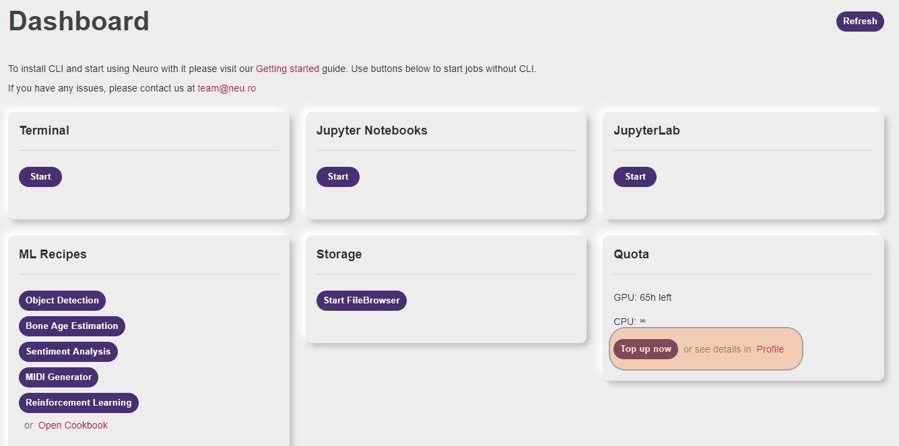

# Clusters \(Resources\)

Clusters are collections of resources - compute, storage, and the registry. When you sign-up on Neu.ro, it provides you access to our public cluster neuro-public. You have the option of creating new clusters; however, you would need additional access. For more information, contact [team@neu.ro](mailto:team@neu.ro).

You can use one cluster at a time and have the option of switching clusters at any time. This tutorial helps you understand how you can manage resources.

### **How do I view my current cluster and its details?**

Each cluster comes with its own set of presets, storage, and registry. You can use the `neuro config show` command to view your current cluster and its details.

```text
> neuro config show
User Configuration:
 User Name            john-doe
 Current Cluster      neuro-compute
 API URL              https://staging.neu.ro/api/v1
 Docker Registry URL  https://registry.neuro-compute.org.neu.ro
Resource Presets:
 Name               #CPU   Memory   Preemptible   Preemptible Node   GPU                     Jobs Avail
────────────────────────────────────────────────────────────────────────────────────────────────────────
 cpu-small             1     4.0G        ×               ×                                           49
 cpu-medium            3    11.0G        ×               ×                                           14
 cpu-large             7    26.0G        ×               ×                                            6
 gpu-k80-small         5    48.0G        ×               ×           1 x nvidia-tesla-k80            26
 gpu-k80-small-p     5.0    48.0G        √               √           1 x nvidia-tesla-k80            30
 gpu-v100-small        5    95.0G        ×               ×           1 x nvidia-tesla-v100           10
 gpu-v100-small-p    5.0    95.0G        √               √           1 x nvidia-tesla-v100           10
```

The command displays the configuration of the current cluster, such as the cluster name, API URL, docker registry URL, and the list of presets available for the cluster.

### **How do I view all my clusters and switch my current cluster?**

You can view the clusters that you have access to and their details. You can use the ****`neuro config get-clusters` command to view the list of clusters that you have access to.

```text
> neuro config get-clusters
Fetch the list of available clusters...
Available clusters:
* Name: neuro-public
  Presets:
    Name         #CPU  Memory  Preemptible  GPU
    cpu-small       1    2.0G       No
    cpu-large       7   28.0G       No
    gpu-small       3   57.0G       No      1 x nvidia-tesla-k80
    gpu-small-p     3   57.0G      Yes      1 x nvidia-tesla-k80
    gpu-large       7   57.0G       No      1 x nvidia-tesla-v100
    gpu-large-p     7   57.0G      Yes      1 x nvidia-tesla-v100
  Name: onprem
  Presets:
    Name       #CPU  Memory  Preemptible  GPU                          
    cpu-small     1    4.0G       No                                   
    cpu-large     4   10.0G       No                                   
    gpu-small    23   60.0G       No      1 x nvidia-geforce-rtx-2080ti
    gpu-large    46  120.0G       No      2 x nvidia-geforce-rtx-2080ti
```

You can switch between clusters by using the `neuro config switch-cluster` command. When you run the command, you are prompted to enter the name cluster that you want to switch to. The current cluster is switched after you provide the name.

```text
> neuro config switch-cluster
Fetch the list of available clusters...
Available clusters:
* Name: neuro-compute
  Resource Presets:
   Name               #CPU   Memory   Preemptible   Preemptible Node   GPU
  ───────────────────────────────────────────────────────────────────────────────────────────
   cpu-small             1     4.0G        ×               ×
   cpu-medium            3    11.0G        ×               ×
   cpu-large             7    26.0G        ×               ×
   gpu-k80-small         5    48.0G        ×               ×           1 x nvidia-tesla-k80
   gpu-k80-small-p     5.0    48.0G        √               √           1 x nvidia-tesla-k80
   gpu-v100-small        5    95.0G        ×               ×           1 x nvidia-tesla-v100
   gpu-v100-small-p    5.0    95.0G        √               √           1 x nvidia-tesla-v100
  Name: onprem-poc
  Resource Presets:
   Name         #CPU   Memory   Preemptible   Preemptible Node   GPU
  ─────────────────────────────────────────────────────────────────────────────────────────────
   cpu-nano      0.2     1.0G        ×               ×
   cpu-small       1     4.0G        ×               ×
   cpu-large       4    10.0G        ×               ×
   gpu-small      23    60.0G        ×               ×           1 x nvidia-geforce-rtx-2080ti
   gpu-large      47   120.0G        ×               ×           2 x nvidia-geforce-rtx-2080ti
   gpu-1x3090   23.0    60.0G        ×               ×           1 x nvidia-geforce-rtx-3090
   gpu-2x3090   47.0   120.0G        ×               ×           2 x nvidia-geforce-rtx-3090
Select cluster to switch [neuro-compute]: onprem-poc
The current cluster is onprem-poc
```

### **How do I view my computation quota?**

You are assigned a computation quota of 100 GPU hours when you sign-up with neu.ro. This quota is used whenever you run a job. Neu.ro provides unlimited hours of CPU that you can use for your jobs.

You can view the remaining computation quota on your dashboard.


You can also use the neuro config show-quota command to view the amount of computation quota left.

```text
> neuro config show-quota
GPU: spent: 35h 54m (quota: 100h 00m, left: 64h 06m)
CPU: spent: 168h 49m (quota: infinity)
```

### How do I request for more computation quota?

You can top up your computation quota by clicking on the **Top Up** button on the dashboard.



You can also write to [team@neu.ro](mailto:team@neu.ro) to know about latest discounts and promotions, and then request the top up.

### How can I create a new cluster? 

Neu.ro lets you create new clusters for better management and orchestration of resources. However, you must remember that the new cluster would require more computation quota. Before you create a cluster, you must decide on the presets, storage, and registry that you want to assign for the cluster. You can create a cluster by writing to us at  [team@neu.ro](mailto:team@neu.ro).

