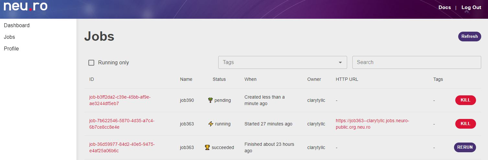
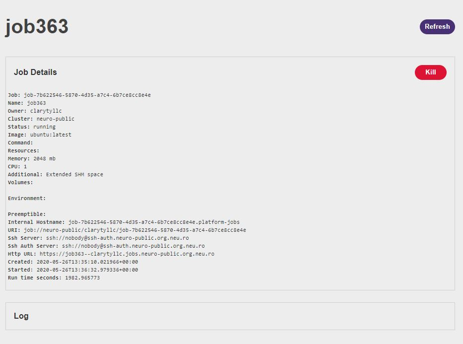
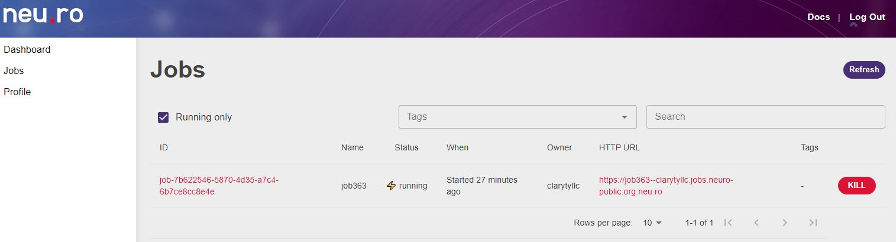
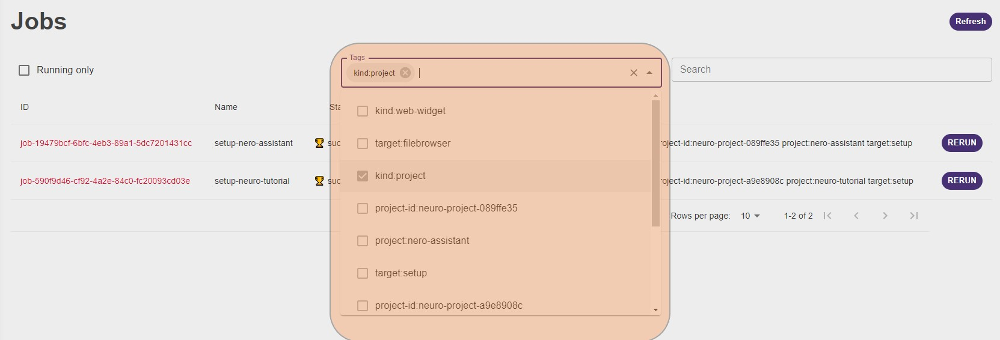
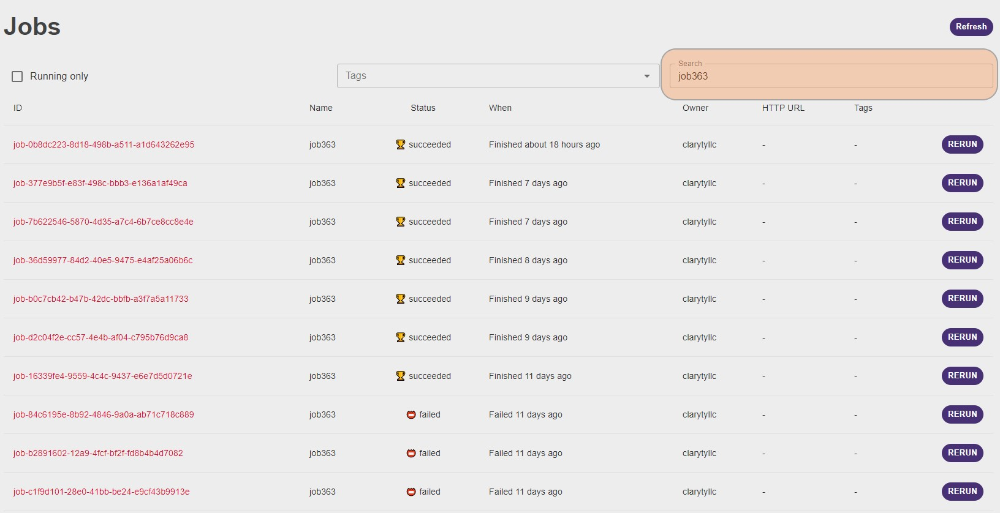
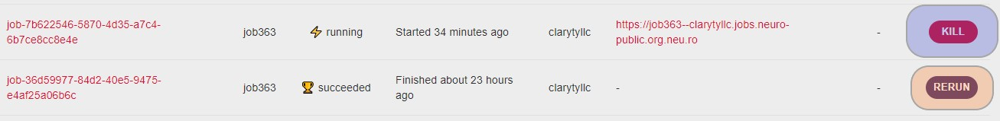

# Jobs

Job is a minimal execution unit. You can run it in a given runtime environment on a given resource preset with given storage volumes attached. Jobs are the building blocks of your project and should be planned carefully for optimum use of the resources.

Before you start a job, you must decide:

- The Docker image to use to run the job. Note that the job terminates if the Docker container fails unless a specific restart policy is used for the job.
- The preset - a combination of CPU, GPU, and memory resources - to use.

In complex projects, you have multiple jobs running with different preset resources that are best suitable for the job.

## What are presets?

Neu.ro lets you run a job in an environment on a given preset with several parts of the storage attached. A preset here is a combination of CPU, GPU, and memory resources allocated.

You must decide and set the amount of CPU, GPU, or memory resources you want to use for a job. By default, if there is no preset mentioned then the preset cpu-small is used. These limits ensure that you can get better resource utilization within a compute cluster.

For example, in this command we are using the preset cpu-small as the job does not need a lot of processing capacity.

**Sample command:**

```
(base) C:\Projects>neuro run --preset cpu-small --name test ubuntu echo Hello, World! 
Job ID: job-43ca33a4-5a4c-4eee-9ac1-67deb7c66e14 Status: pending
Name: test
Http URL: https://test--clarytyllc.jobs.neuro-public.org.neu.ro
Shortcuts:
  neuro status test # check job status
  neuro logs test # monitor job stdout
  neuro top test # display real-time job telemetry
  neuro exec test bash # execute bash shell to the job
  neuro kill test # kill job
Status: pending Creating
Status: pending Scheduling
Status: running
Terminal is attached to the remote job, so you receive the job`s output.
Use Ctrl-C to detach (it will NOT terminate the job), or restart thejob with `--detach` option.
Hello, World!
```

Neu.ro comes with a set of presets that are suitable for running different kinds of workloads. Some of the jobs may also require GPU resources. You can view the list of available presets for you using the command neuro config show.

```
(base) C:\Projects>neuro config show
User Configuration:
  User Name: clarytyllc
  Current Cluster: neuro-public
  API URL: https://staging.neu.ro/api/v1
  Docker Registry URL: https://registry.neuro-public.org.neu.ro
  Resource Presets:
    Name         CPU    Memory    Preemptible    GPU
    cpu-small    1.0    2.0G          No
    cpu-large    7.0    28.0G         No
    gpu-small    3.0    57.0G         No         1 x nvidia-tesla-k80
    gpu-small-p  3.0    57.0G         Yes        1 x nvidia-tesla-k80
    gpu-large    7.0    57.0G         No         1 x nvidia-tesla-v100
    gpu-large-p  7.0    57.0G         Yes        1 x nvidia-tesla-v100
```

The command lists the available presets and their configurations. For example, the cpu-small preset includes 1 CPU, 2GB memory, and no GPU. Whereas, the gpu-large includes 7 CPU, 57GB memory, and an nvidia-tesla-v100 GPU.

## How do I run a job?

To run a job in CLI, you can use the `neuro run` command. This command accepts a lot of different arguments, most of which are explained in this and the following sections.

Each job has a unique ID. For your convenience, you can give a job a name. There can be only a single PENDING or RUNNING job with a given name.

Each job has access to its ephemeral storage (which is essentially a piece of SSD on the physical machine this job runs on). This type of storage is fast but not persistent: as soon as you kill the job, the data is lost.

To persist the data you can mount the volumes of the platform storage to the job. This type of storage is slightly slower and has some limitations. For example, running a model training on the data from the mounted folder is generally 10-20% slower. Also, random write operations (e.g. unzipping an archive) are very slow and highly unrecommended.

**Sample commands:**

1. **Run a fast job without mounting storage:**

```
(base) C:\Projects>neuro run --preset cpu-small --name job230 ubuntu echo Hello, World!
Job ID: job-43ca33a4-5a4c-4eee-9ac1-67deb7c66e14
Status: pending
Name: job230
Http URL: https://job230--clarytyllc.jobs.neuro-public.org.neu.ro
Shortcuts:
  neuro status job230 # check job status
  neuro logs job230 # monitor job stdout
  neuro top job230 # display real-time job telemetry
  neuro exec job230 bash # execute bash shell to the job
  neuro kill job230 # kill job
Status: pending Creating
Status: pending Scheduling
Status: running
Terminal is attached to the remote job, so you receive the job`s output.Use Ctrl-C to detach (it will NOT terminate the job), or restart thejob with `--detach` option.
Hello, World!
```

1. **Running a long training job with mounting storage**

```
(base) C:\Projects>neuro run --name job303 --volume storage:nero-assistant/ModelCode/:/code:rw --preset cpu-small neuromation/base python /code/train.py
Job ID: job-43ca33a4-5a4c-4eee-9ac1-67deb7c66e14
Status: pending
Name: job303
Http URL: https://job303--clarytyllc.jobs.neuro-public.org.neu.ro
Shortcuts:
  neuro status job303 # check job status
  neuro logs job303 # monitor job stdout
  neuro top job303 # display real-time job telemetry
  neuro exec job303 bash # execute bash shell to the job
  neuro kill job303 # kill job
Status: pending Creating
Status: pending Scheduling
Status: runningTerminal is attached to the remote job, so you receive the job`s output.Use Ctrl-C to detach (it will NOT terminate the job), or restart the job with `--detach` option.
Epoch 1:14%|█▍ | 1380/10000 [00:13<01:26, 99.29it/s]
```

## How can I see the list of currently running jobs?

You can use the neuro ps command to list the jobs that are currently running. You can use various options to filter the list of jobs, based on status, owner, or by name. To know information about a particular job, you can use the neuro job status command.

**Sample Commands:**

1. **See the list of all currently running jobs**

```
(base) C:\Projects>neuro ps
ID                                       NAME   STATUS  WHEN           IMAGE          OWNER  CLUSTER      DESCRIPTION
job-3erw4f2e-cc57-4e4b-af04-c795b76d9ca8 job363 running 6 seconds ago  ubuntu:latest  <you>  neuro-public
job-d2c04f2e-cc57-4e4b-af04-c795b76d9ca8 job390 pending 26 seconds ago ubuntu:latest  <you>  neuro-public
```

1. **See the list of job in the status pending**

```
(base) C:\Projects>neuro ps -s pending
ID                                        NAME   STATUS   WHEN          IMAGE         OWNER   CLUSTER      DESCRIPTION
job-d2c04f2e-cc57-4e4b-af04-c795b76d9ca8  job390 running  3 minutes ago ubuntu:latest <you>   neuro-public
```

## Can I connect to a job when it is running?

When running a job, you might sometimes want to connect to the job and execute a command. You can use the neuro job exec command to connect to a running job.

**Sample command:**

1. **Running a simple list command in the container hosting the job**

```
(base) C:\Projects>neuro job exec job363 ls
bin dev home lib32 libx32 mnt proc run srv tmp varboot etc lib lib64 media opt root sbin sys usr
Connection to ssh-auth.neuro-public.org.neu.ro closed.
```

1. **Providing a bash terminal to the container hosting the job**

```
(base) C:\Projects>neuro job exec job363 /bin/bash
root@job-36d59977-84d2-40e5-9475-e4af25a06b6c:/# echo "Hello, World!"
Hello, World!
root@job-36d59977-84d2-40e5-9475-e4af25a06b6c:/# exit
exit 
Connection to ssh-auth.neuro-public.org.neu.ro closed.
```

A bash terminal lets you work on the container while the job is running.

## What are job states?

A job is the smallest execution unit that is run until completion or until it is killed. A job goes through many states until it is complete or fails. You can view the current state of a job by using the neuro job status command.

**Sample command:**

```
(base) C:\Projects>neuro job status job363
Job: job-b0c7cb42-b47b-42dc-bbfb-a3f7a5a11733
Name: job363
Owner: clarytyllc
Cluster: neuro-public
Status: running
Image: ubuntu:latest
Command: sleep infinity
Resources:
  Memory: 2.0
  GCPU: 1.0
  Additional: Extended SHM space
Preemptible: False
Life span: 1d
Internal Hostname: job-b0c7cb42-b47b-42dc-bbfb-a3f7a5a11733.platform-jobs
Http URL: https://job363--clarytyllc.jobs.neuro-public.org.neu.ro
Http authentication: True
Created: 2020-05-24T14:50:00.540688+00:00
Started: 2020-05-24T14:50:04.680265+00:00
```

A job can have one of the following states:

- Pending: When the job is created and the resources for the job are allocated.
- Running: When a job is executing.
- Complete: When a job is complete.
- Failed: When a job fails and exits with an error code.

## How do I expose the HTTP server running in a job?

A lot of applications you run on a platform have some web interface, such as Jupyter Notebooks, TensorBoard, and others. When you run a job containing such an application you may access this web interface in your browser. For that, you need to pass a port that should be exposed via the `--port` option (which is 80 by default).

To open the exposed interface in the browser, there are several options:

- Pass `--browse` as a `neuro run` parameter: in this case, an OS default web browser will open up as soon as the job is runnings;
- Run `neuro job browse <NAME or ID>` when the job is already running;
- Click on the HTTP URL for this job at the Neu.ro dashboard.

All jobs you run are hidden behind SSO by default. This means that if you share a link to the job web interface with someone, they will have to log into the platform and have granted permission to access the job (see the section below). To expose a job to everyone you need to pass `--no-http-auth` to `neuro run`. We strongly recommend avoiding this option unless you are completely sure that you want to omit the SSO security check.

Example:

```
neuro run --name filebrowser-demo --preset cpu-small --http 8085 --no-http-auth --browse --volume storage::/srv:rw filebrowser/filebrowser --noauth --port 8085
```

This command runs a FileBrowser instance on 8085 port, exposes this port, removes SSO check, and opens the web interface in your default browser when the job is running.

## How do I control the job duration?

You can control the duration of time for which jobs run using the life-span configuration parameter. You can update the life-span parameter in the [job] section of the global configuration file. The global configuration file is located in the standard neuro config path. The Neu.ro CLI uses ~/.neuro folder by default, and the path for global config file is ~/.neuro/user.toml.

The parameter limits the default job run time, and is in string format. For example, a value of 2d3h20min would limit the job run time to 2 days, 3 hours, and 20 minutes.

You can also set this parameter on each job run using the corresponding option: `neuro run --life-span 2h …`

**Example:**

```
# jobs section
[job]
life-span = "2d3h20min"
```

## How do I terminate a job?

You can terminate any job using the neuro job kill command. You must know the job name or job id to terminate a job.

**Sample command:**

```
(base) C:\Projects>neuro job kill
job363job-36d59977-84d2-40e5-9475-e4af25a06b6c
```

## Can I share a job with others?

Yes, neu.ro lets you share any running jobs with you teammates. You can get all details of currently running jobs using the command `neuro ps`. This command lists all the jobs that you own and that are shared with you.

**Sample command to view all running jobs:**

```
(base) C:\Projects>neuro ps
ID                                       NAME   STATUS   WHEN           IMAGE            OWNER   CLUSTER      DESCRIPTION
job-7c384fe1-af22-4514-9b06-e9445df46143 job390 pending  11 seconds ago pytorch:latest  <you>   neuro-public
job-0b8dc223-8d18-498b-a511-a1d643262e95 job363 pending  5 seconds ago  ubuntu:latest   <you>   neuro-public
```

Before sharing a job, you must know the ID of the job. After identifying the job you want to share, you must use the neuro share job command to share the job.

**Sample command to share a job:**

**neuro share job:job363 mrsmariyadavydova manage**

This shares the job363 job with mrsmariyadavydova and provides the teammate manage access. You can provide the teammate the access to read, write, or manage. Now, your teammate can use the neuro ps command to view this job in their list of accessible jobs.

## Where can I find the logs from a job?

You can view the complete log for a job using the neuro job logs [job name or id] command. The command displays logs for the job specified.

The log is also displayed if you do not pass the --detach option when the job is run. The --detach option ensures that the job is not attached to logs and does not wait for exit code.

**Sample Command:**  **neuro job logs job363**

```
(base) C:\Projects>neuro job logs job-757f5cd0-7323-476a-ba0e-ebe746f24618
$Using ubuntu image
$
$Running the job
$
$No errors.
$
$Job completed
```

## Can I manage jobs from the web UI?

Neuro provides an intuitive interface that lets you manage jobs. The jobs page of the Neu.ro web interface lists all the jobs.



You can view the web interface of the job by clicking on the HTTP URL.


To view the log and and other details about a job, click on the job ID.



You can view only the running job by clicking on the **Running only** check box.



You can filter the available jobs based on the tags associated with them such as kind:project or target:setup.



You can also filter jobs by searching for them by entering the search criteria in the search box.



The UI also lets you kill or rerun a job by clicking on **Kill** or **Rerun** buttons.

