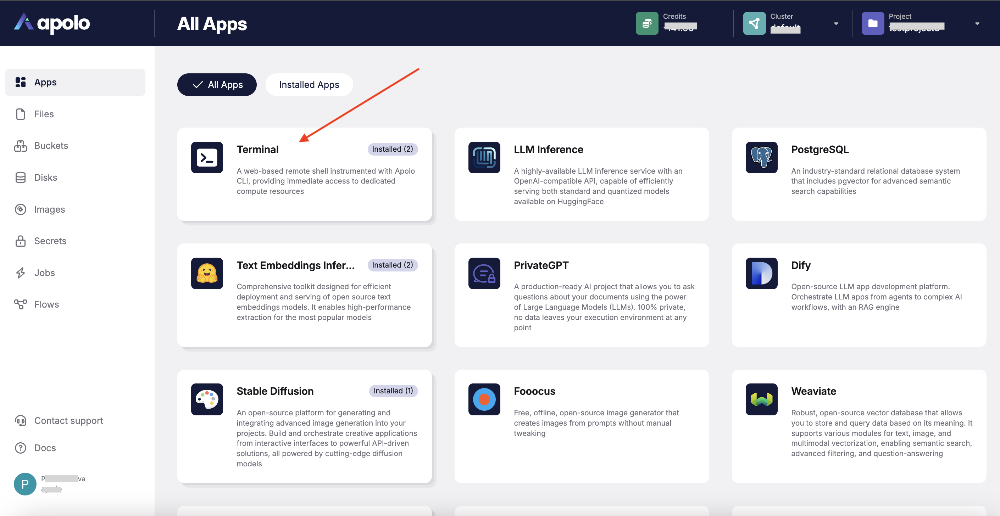
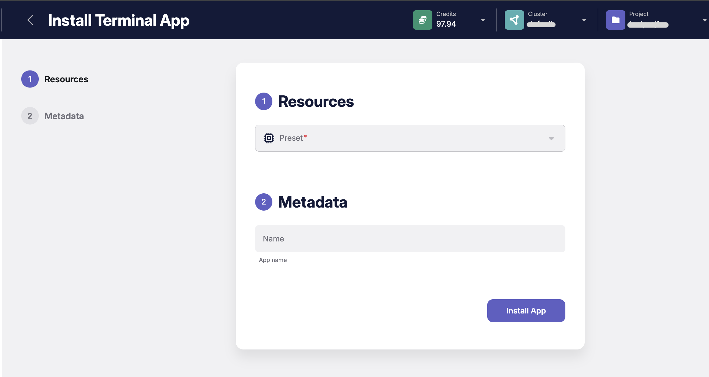
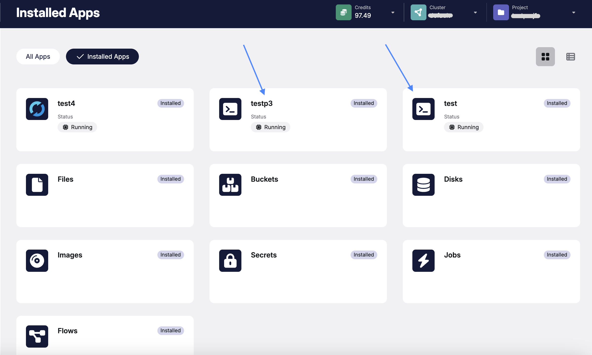
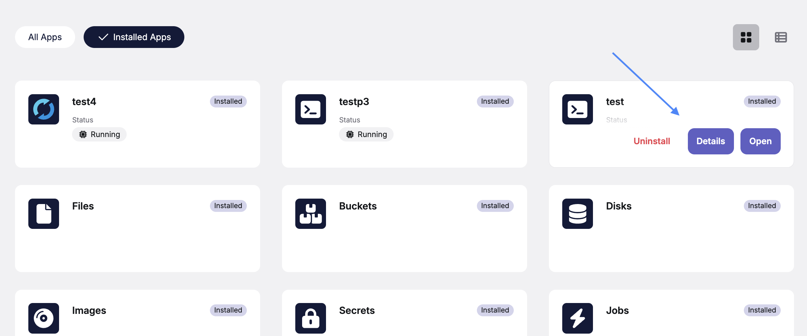
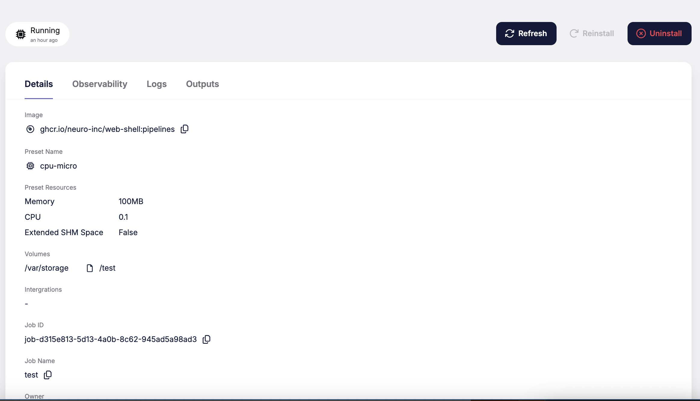
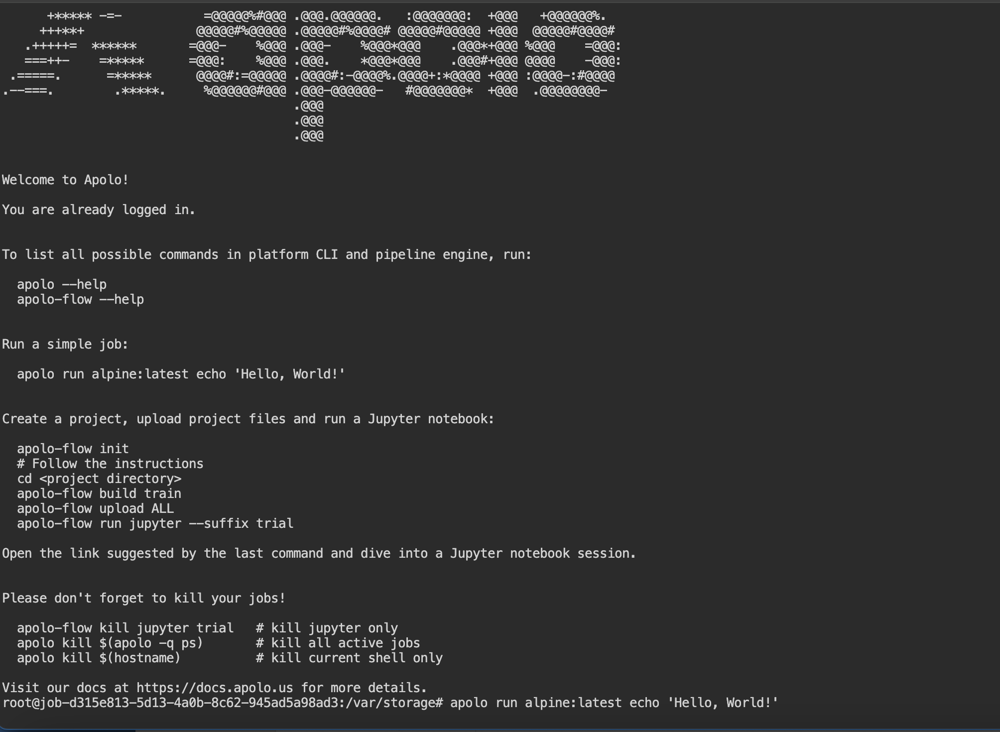
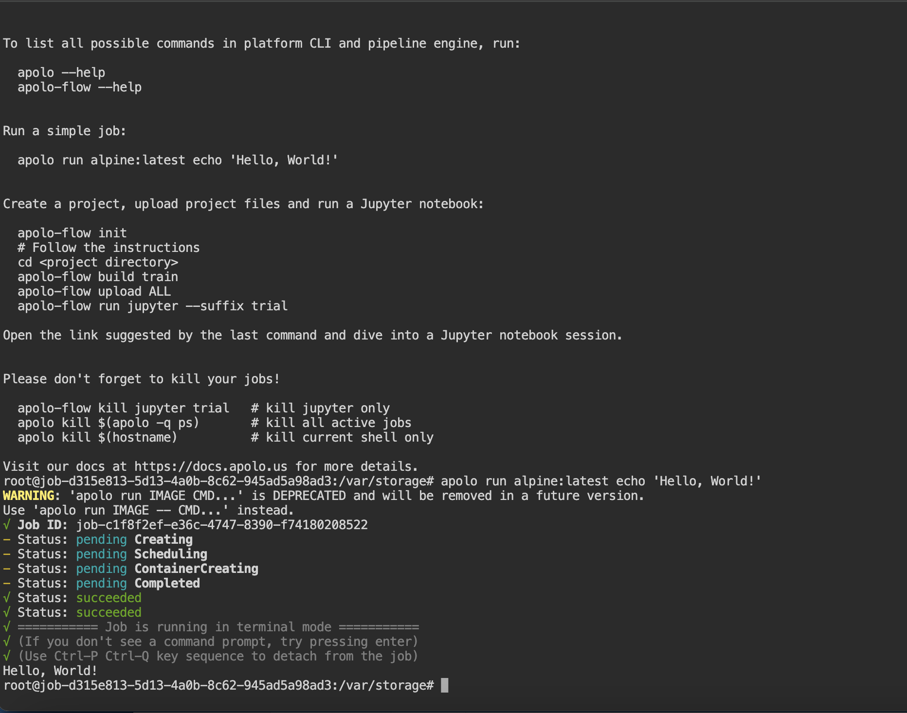

# Terminal

The Apolo Terminal app allows users to execute shell commands, manage files, and interact with computational resources directly through a web-based interface. This guide provides step-by-step instructions for accessing, installing, and using the Terminal app.

## Accessing the Terminal App

Navigate to the **Apolo Console** and click on the **Apps** section from the left-hand navigation menu. You will see a list of available apps, as shown in the screenshot below.



Locate the **Terminal** app. If it is not yet installed, proceed to the installation steps.

## Installing the Terminal App

1.  Select the **Terminal** app.

    Click on the button **Install** located on the **Terminal** app card.
2.  Configure _resources_.

    After selecting the Terminal app, you will be redirected to the installation page. Under the **Resources** tab, choose a preset configuration based on your computational needs (e.g., `cpu-small`, `cpu-medium`).
3.  Add _metadata_.\
    In the next step, under the **Metadata** tab, provide a name for your app instance.

    
4. Install the App.\
   Click on the **Install App** button to complete the installation process. The app will appear in the **Installed Apps** tab once successfully deployed.

## Managing Installed Terminal Apps

To view and manage installed instances of the Terminal app:

1. Go to the **Installed Apps** tab.
2.  You will see a list of running **Terminal** app instances.

    

You can look its details by clicking on the button **Details** for each instance.



**Details page** contains the next information:

* Terminal settings (Image name, preset name, preset resources, etc.)
* App status transition
* Telemetry
* Logs
* Outputs values



## Using the Terminal App

1.  Launch the **Terminal**.

    Click **Open** button on an instance of the **Terminal** app from the **Installed Apps** list. This will open a web-based shell environment.
2.  Run Commands.\
    Use the terminal to execute shell commands. A welcome message provides helpful examples of commands you can run, such as managing Apolo CLI workflows and running jobs.

    **Example:**

    ```bash
    apolo run alpine:latest echo 'Hello, World!'
    ```

    

    
