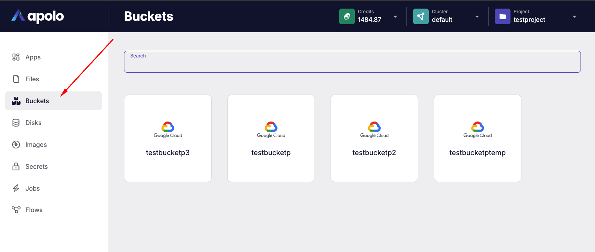

# Buckets

The Buckets application in the Apolo Console provides a user interface for managing cloud storage buckets within a specific project and cluster. Buckets can be used to store and organize large amounts of data, such as backups, application data, and other persistent resources, across cloud providers.

This application is accessible from the left-side navigation menu in the Apolo Console. The buckets page displays all storage buckets associated with the selected project and cluster, provides details about each bucket, and offers the option to manage credentials.

For each bucket you can create its own credentials with the specific role _Read-Only_ or _Read & Write_. The interface provides the ability to create several credentials with different roles and to review details for previously created.

