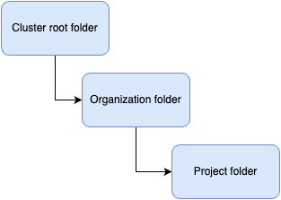

# Files

## Overview

The Files application is a comprehensive file management system designed to help you organize and manage your network storage within the cluster. This documentation will guide you through its features and functionality using Apolo Console. To learn more about how to manage the Files app with Apolo CLI, visit the [Apolo CLI Files app](../../../../../cli/apps/files.md) page.

### **Storage Organization**

Your organization receives a storage space within the cluster, structured in a hierarchical manner:

* Organization Level: The root folder for all your organization's files
* Project Level: Individual project folders within your organization
* Custom Folders: User-created folders for further organization

### **Core Features**

_**Adding New Folders**_ You can create new folders to organize your files by clicking the "Add Folder" button. The system will prompt you with a dialog where you can specify the folder name. These folders help maintain a structured file hierarchy within your project space.

_**File Upload**_ The system supports file uploads through two methods:

1. Using the "Upload" button
2. Drag-and-drop functionality directly into the interface

_**Navigation and Search**_ The interface provides several navigation tools:

* Search bar: Located at the top of the interface for quick file location
* Home button: Returns you to your project's root folder
* Grid/List view toggle: Allows you to switch between viewing modes
* Folder Up: Navigate to the parent folder using the dedicated button

_**File and Folder Management**_&#x20;

For each file and folder, you can:

* View properties including:
  * Save location (full path)
  * File extension
  * Last modified date
  * File size
* Perform actions such as:
  * Rename items
  * Delete items
  * Copy/move items
  * View detailed properties
