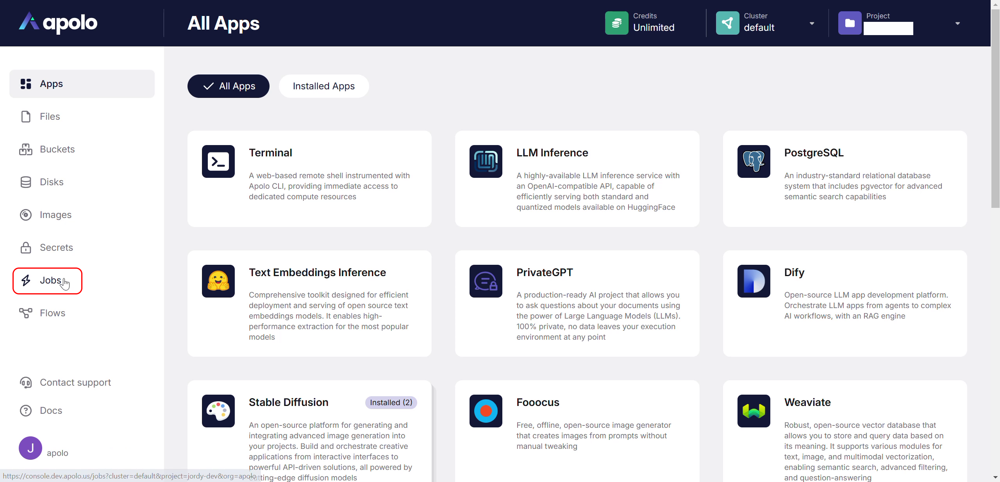
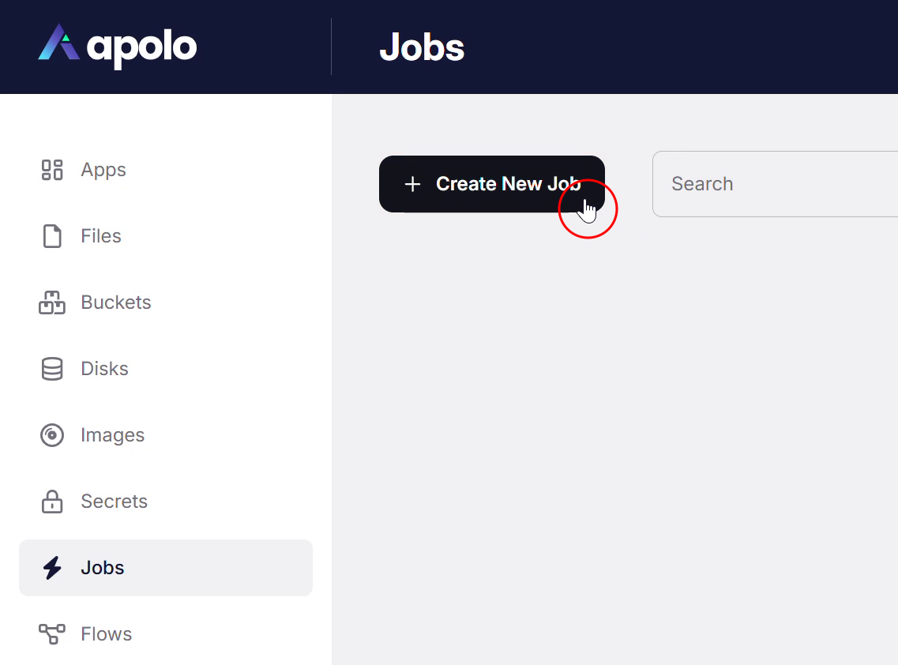
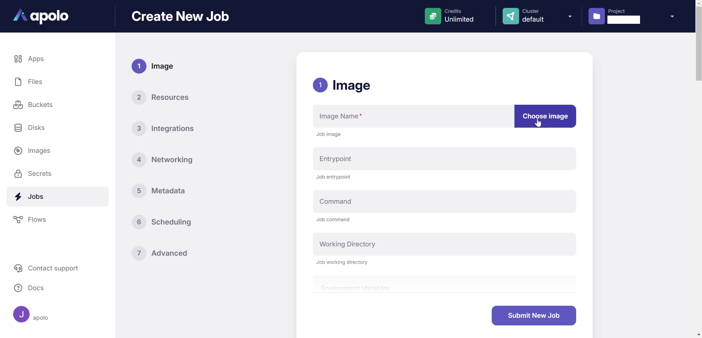
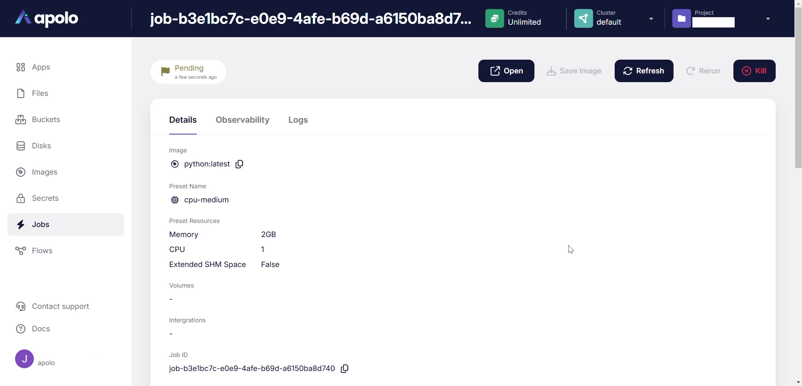
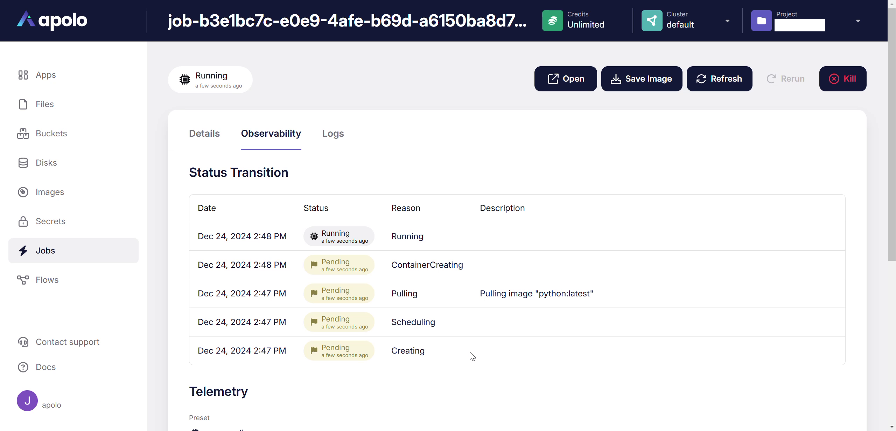

# Jobs

## Overview

The **Jobs** App is a tool that allows users to schedule and execute containerized tasks and processes. It provides a user-friendly interface to manage these workloads, simplifying tasks like data processing, model training and inference, and other batch jobs. This app is designed to provide flexibility and control over how these jobs are run, while offering monitoring features for insights and debugging. Key features of the Jobs App include:

* **Containerized Execution:** Jobs are run inside containers, allowing for consistency and portability.
* **Resource Management:** Users can allocate specific CPU, memory, and GPU resources to each job based on presets available in the cluster&#x20;
* **Flexible Scheduling:** Jobs can be set to run immediately or scheduled for future execution.
* **Monitoring and Logs:** Real-time monitoring, logs, and telemetry allow users to observe the job's performance and troubleshoot issues.

## Running jobs

The Apolo platform offers multiple interfaces to manage jobs: the Web UI, the Command Line Interface (CLI), and a Python SDK. This guide will explaining the process of creating jobs via the Web UI. To learn more about running jobs using Apolo CLI, visit the Apolo CLI [Jobs app page](../../../../../../cli/apps/jobs.md).

### Using the Web UI

#### Steps

1.  **Navigate to the Jobs App:**

    * From the main page, go to the left-hand menu.
    * Click on the "Jobs" option in the left hand menu. This will open the Jobs dashboard.

    
2.  **Initiate Job Creation:**

    * In the Jobs dashboard, click the "Create New Job" button. This will bring you to the "Create New Job" form.

    
3.  **Configure Job Details**

    * The job creation form has seven steps: Image, Resources, Integrations, Networking, Metadata, Scheduling and Advanced

    

    * **Image:**
      * **Image Name:** Enter a name for your job's image, for instance, "python/latest".
      * **Entrypoint:** Specify the command that will execute in the container when your job runs. For example: python -m http.server 4567.\
        Note: You can also set other configurations in this section if necessary like command, Working Directory, and Environment Variables.
    * **Resources:**
      * **Preset:** Click on the dropdown menu labeled 'Preset'.
      * Choose a preset for your job by selecting it from the popup. Preset determines the compute resources allocated to the job. For example, cpu-medium.
      * Click Apply to select the preset.\
        Note: You can add Volumes to the Job in this step.
    * **Integrations:**
      * Connect your job to a MLFlow Server or the Apollo Engine by clicking the corresponding dropdown menus.
    * **Networking:**
      * Configure the HTTP port to expose.\
        Note: You can also configure HTTP authentication in this step.
    * **Metadata:**
      * **Name:** Enter the name you want to give to your job.
      * **Description:** Add an optional description to help understand what your job is for.\
        Note: You can add Tags to the Job in this step.
    * **Scheduling:**
      * **Restart policy**: Pick the behavior that the Job should take if it fails
      * Configure Lifespan, Schedule Timeout, Priority and Wait for jobs quota in this section.
    * **Advanced**
      * Set more specific settings for the Job, like Request extended "/dev/shm" space, Launch the job in a privileged mode, and Allocate TTY.
4. **Submit the Job:**
   * Once you have configured all the necessary details, click the "Submit New Job" button at the bottom of the form. This submits the job to the queue for scheduling.
5.  **Monitor Job Status:**

    * After submitting, you'll be redirected to the job's detail page.

    

    * The job starts in Pending state.
    * The status will change during its execution from Pending, to Running and finally to Succeeded or Failed.
    * You can view the logs, telemetry, and details in the corresponding tabs.
6.  **Access Job Output**

    * Click the Open button to access the Job output from a browser.\
      Note: You can view Status transition in the Observability tab to check the state of the Job at specific times.\
      Note: You can also Save Image, Refresh, and Rerun the Job in this screen.

    
7. **Review Jobs**
   * Go back to the Jobs dashboard. Here you can view a list of Jobs, and filter it by status.

To learn more about debugging and monitoring jobs once they are started, visit the [Apolo CLI Jobs app page](../../../../../../cli/apps/jobs.md#debugging-jobs).
