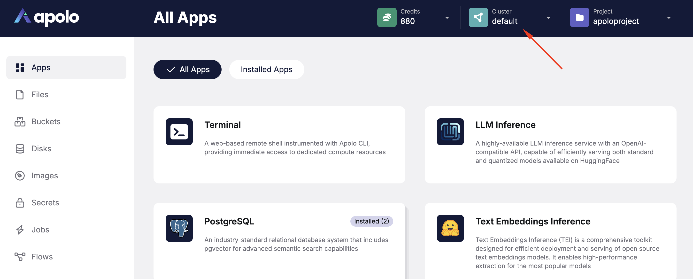
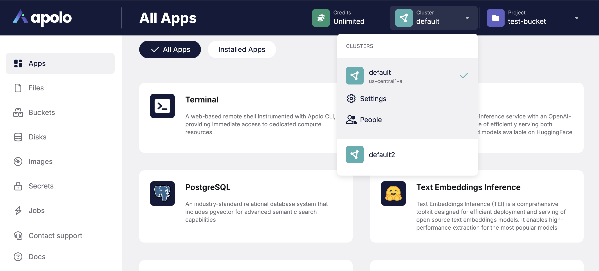

# Clusters

Clusters are collections of resources - compute, storage, and the registry. When you sign-up on Apolo, you could ask someone that have respective access level to add you to their organization. This provides access to clusters the organization has access to.

Under the hood, cluster is a [Kubernetes](https://kubernetes.io/) cluster being managed by Apolo services.

You can also create new clusters, but this requires additional access. For more information, contact [support@apolo.us](mailto:support@apolo.us).

You can use one cluster at a time and switch between clusters. This tutorial will helps you understand how you can manage resources.

### **How can I manage my clusters?**

Each cluster comes with its own storage, registry, resource presets and other services.

You can view information about your current cluster both in the CLI and in the Apolo Console:



You can use the `apolo config show` command to view the current cluster's name, API URL, docker registry URL, and the list of presets available for this cluster.

```
$ apolo config show
User Configuration:                                       
 User Name            john-doe                      
 Current Cluster      default                             
 Current Org          <no-org>                            
 Current Project      myproject 
 Credits Quota        unlimited                           
 Jobs Quota           unlimited                           
 API URL              https://staging.neu.ro/api/v1       
 Docker Registry URL  https://registry.default.org.neu.ro 
Resource Presets:                                                                                                          
 Name               #CPU   Memory   Round Robin   Preemptible Node   GPU                     Jobs Avail   Credits per hour 

 cpu-small             1     4.0G                                                                  55   1                
 cpu-medium            3    11.0G                                                                  15   2                
 cpu-large             7    28.0G                                                                   7   4                
 gpu-k80-small         3    57.0G                                  1 x nvidia-tesla-k80            30   10               
 gpu-k80-small-p       3    57.0G                                  1 x nvidia-tesla-k80            10   1                
 gpu-v100-small        7    57.0G                                  1 x nvidia-tesla-v100           10   32               
 gpu-v100-small-p      7    57.0G                                  1 x nvidia-tesla-v100           10   4                
 gpu-small             3    57.0G                                  1 x nvidia-tesla-k80            30   10               
 gpu-small-p           3    57.0G                                  1 x nvidia-tesla-k80            10   1                
 gpu-v100-large       63   480.0G                                  8 x nvidia-tesla-v100            4   256              
 gpu-v100-large-p     63   480.0G                                  8 x nvidia-tesla-v100            4   32               
 gpu-v100-2           15   115.0M                                  2 x nvidia-tesla-v100           16   64               
 gpu-v100-4           31   235.0M                                  4 x nvidia-tesla-v100            8   128              
 gpu-v100-8           63   480.0M                                  8 x nvidia-tesla-v100            4   256
```



To view information about your current cluster in the Apolo Console, look at the top right corner of the screen. You will see a section labeled "Cluster" with the name of your current cluster (e.g., "default"). Clicking on the dropdown arrow next to the cluster name will provide more details about the current cluster.





### **How can I view all my clusters and switch my current cluster?**

You can view the list of available clusters and switch between them both in the CLI and in the Apolo Console:



You can use the `apolo config get-clusters` command to view the list of clusters that you have access to and information about them.

```
$ apolo config get-clusters
Fetch the list of available clusters...
Available clusters:
* Name: neuro-public
  Presets:
    Name         #CPU  Memory  Preemptible  GPU
    cpu-small       1    2.0G       No
    cpu-large       7   28.0G       No
    gpu-small       3   57.0G       No      1 x nvidia-tesla-k80
    gpu-small-p     3   57.0G      Yes      1 x nvidia-tesla-k80
    gpu-large       7   57.0G       No      1 x nvidia-tesla-v100
    gpu-large-p     7   57.0G      Yes      1 x nvidia-tesla-v100
  Name: onprem
  Presets:
    Name       #CPU  Memory  Preemptible  GPU                          
    cpu-small     1    4.0G       No                                   
    cpu-large     4   10.0G       No                                   
    gpu-small    23   60.0G       No      1 x nvidia-geforce-rtx-2080ti
    gpu-large    46  120.0G       No      2 x nvidia-geforce-rtx-2080ti
```

You can switch between clusters by using the `apolo config switch-cluster` command. When you run the command, you are prompted to enter the name of the cluster you want to switch to. The current cluster is switched after you provide the name.

```
$ apolo config switch-cluster
Fetch the list of available clusters...
Available clusters:
* Name: default
  Resource Presets:
   Name               #CPU   Memory   Preemptible   Preemptible Node   GPU
  ───────────────────────────────────────────────────────────────────────────────────────────
   cpu-small             1     4.0G        ×               ×
   cpu-medium            3    11.0G        ×               ×
   cpu-large             7    26.0G        ×               ×
   gpu-k80-small         5    48.0G        ×               ×           1 x nvidia-tesla-k80
   gpu-k80-small-p     5.0    48.0G        √               √           1 x nvidia-tesla-k80
   gpu-v100-small        5    95.0G        ×               ×           1 x nvidia-tesla-v100
   gpu-v100-small-p    5.0    95.0G        √               √           1 x nvidia-tesla-v100
  Name: onprem-poc
  Resource Presets:
   Name         #CPU   Memory   Preemptible   Preemptible Node   GPU
  ─────────────────────────────────────────────────────────────────────────────────────────────
   cpu-nano      0.2     1.0G        ×               ×
   cpu-small       1     4.0G        ×               ×
   cpu-large       4    10.0G        ×               ×
   gpu-small      23    60.0G        ×               ×           1 x nvidia-geforce-rtx-2080ti
   gpu-large      47   120.0G        ×               ×           2 x nvidia-geforce-rtx-2080ti
   gpu-1x3090   23.0    60.0G        ×               ×           1 x nvidia-geforce-rtx-3090
   gpu-2x3090   47.0   120.0G        ×               ×           2 x nvidia-geforce-rtx-3090
Select cluster to switch [default]: onprem-poc
The current cluster is onprem-poc
```



To view all your clusters and switch the current one, click on the dropdown arrow next to the cluster name in the top right corner. A menu will appear with all available clusters. Select the desired one to switch.





### **How can I view my credits?**

Usually, you are assigned a computation quota in term of credits. Those credits are consumed whenever you run a job. Credits are cluster-bound which means, you have different balances in different clusters.

You can view the remaining credits on your Apolo Console dashboard. The `apolo config show` command also shows the amount of credits left as part of its output too.

### How can I request for more credits?

You can top up your credits by clicking the **Credits** menu on the Apolo Console dashboard.

You can also contact [support@apolo.us](mailto:support@apolo.us) or corresponding cluster provider to learn about latest discounts and promotions, and then request the top up.

### How can I create a new cluster?

Apolo lets you create new clusters for better management and orchestration of resources. Before you create a cluster, you must decide on the presets, storage, and registry that you want to assign for this cluster. You can create a cluster by writing to us at [support@apolo.us](mailto:support@apolo.us).
