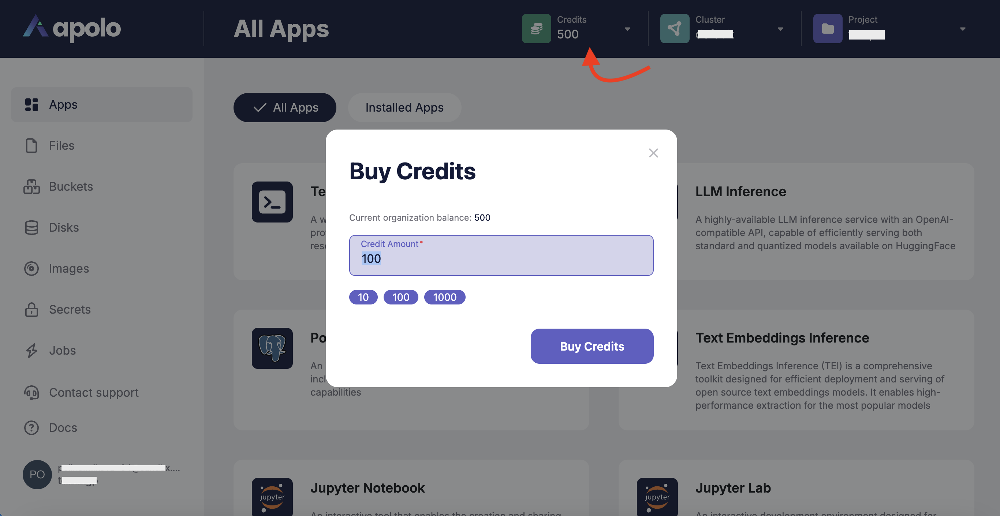
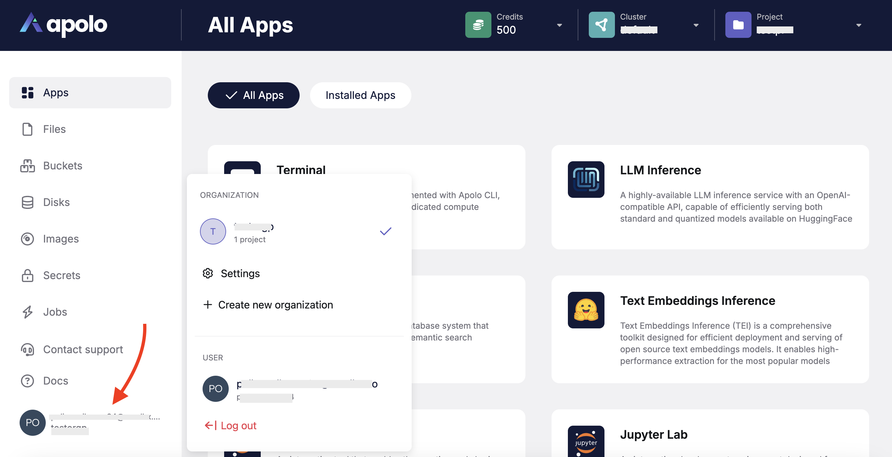
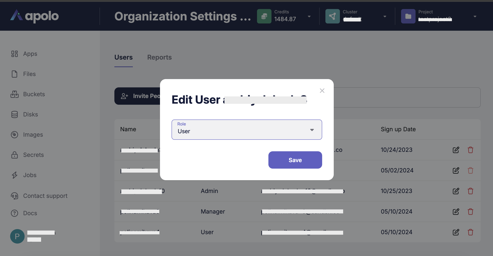
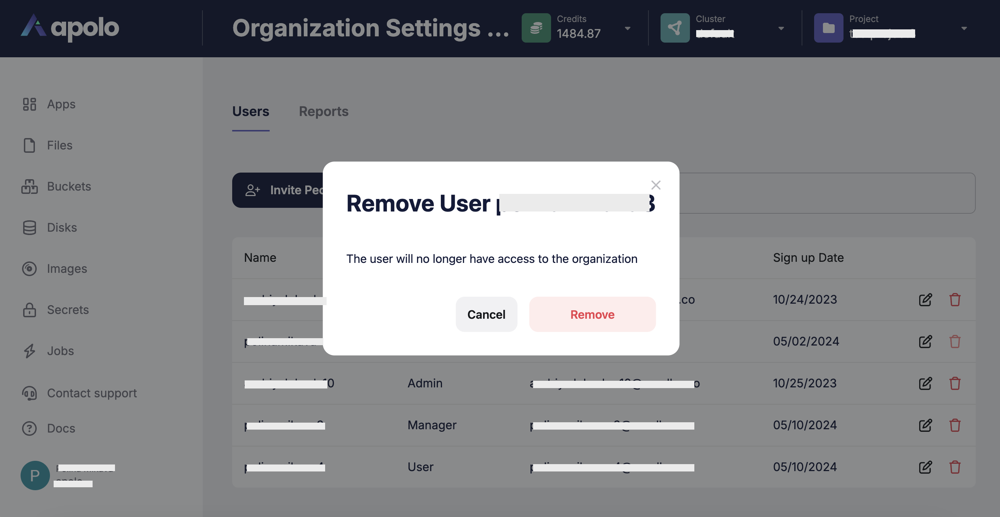

# Organizations

## Start with organization

Organizations are formed as a collections of users that have common access to some subset of clusters and could share credits.

After account creating you have two options:

* create your own organization;
* send your user name for adding to the existed organization.

By inviting other users into organizations, those users automatically obtain access to all clusters organization was added to.

When users run their apps within organization, they consume this organization credits which enables teams to have shared balance.

Team members could also top-up organization balance in Apolo web app by clicking on the Credits menu.

Refer to `apolo admin` for organizations administration and to `apolo config switch-org` to switch between organizations within your CLI config.

Most of Apolo CLI accept `--org` flag to perform various commands in corresponding organizations.

## Set up organization

As administrator you can set up your current organization or create one more lately.

You can manage a user list and look through reports in organization settings.

Users tab contains the next functionality:

* inviting users to the organization;

* setting up user role;

* deleting user from organization.

Reports tab contains grafana dashboards.

## Organization roles

Organization participants could be of one of available roles: user, manager, admin. Each subsequent role expands on the previous one.

#### User

Only able to read organization participants, create own projects or being invited to other people's projects.

#### Manager

See all projects within the organization, configure user job's quotas, see organization artifacts, promote other users up to manager within the organization

#### Admin

Remove organization, promote other users up to admin within the organization.

When you create organization, you become it's administrator.
