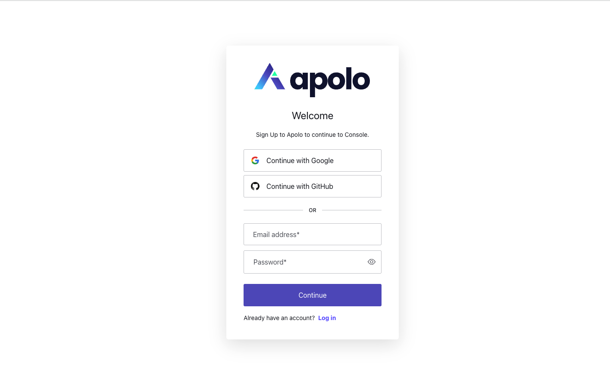

# Sign Up, Login

### Sign-up

First of all you should create an account in [Apolo Console](https://console.apolo.us):

1. Go to [Apolo Console](https://console.apolo.us);

2. Click "Sign-up" button;
3. Enter your e-mail and create a password;
4. Click "Continue" button;
5. Verify your e-mail via verification link which was sent to your e-mail;
6. Enter your username and click "Sign up" button;
7. Read and accept terms of use agreement;
8. Start your onboarding from [connecting or creating organization](organizations.md).

Also, you can create your account using Google or GitHub accounts.

### Login

On the login page you can execute login using your credentials. On this page you have availability to reset your password in case you forgot it.

### Forgot password

In case of forgetting your password, follow this instruction:

1. Click "Forgot password" button;

2. Enter your email;
3. Follow the instructions which was sent to your e-mail.

