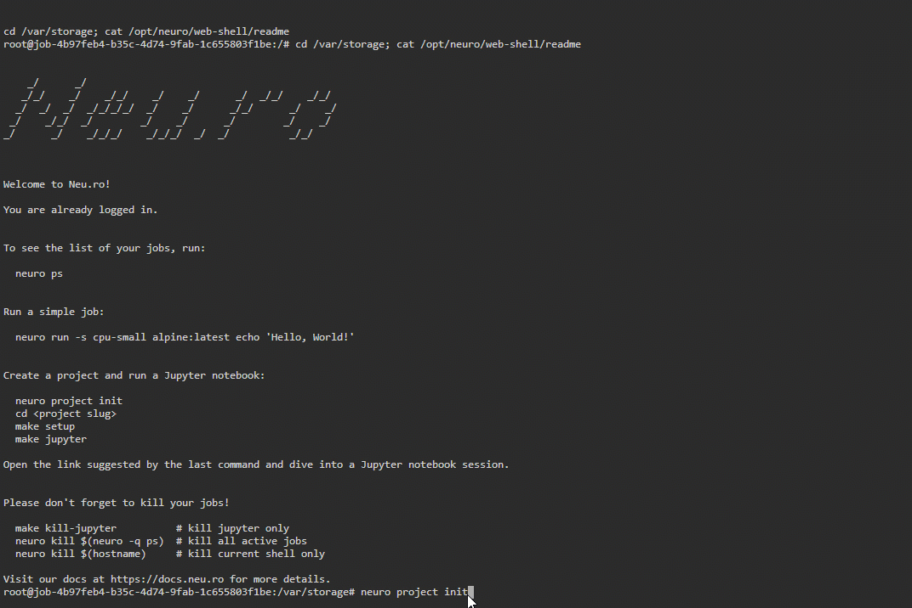

# Terminal

## Introduction

Terminal let you work with Apolo without setting up the local environment. Terminals are jobs, and active terminals are listed on the Apolo dashboard.

You can start a new terminal by clicking **RUN A JOB** in the **Terminal** widget:

 (1).png>)

You can use the terminal to manage jobs and your docker environments. You should kill the terminal session whenever you're done working with it. All terminal sessions are automatically killed after 24 hours.

When you start a terminal, the platform storage is attached as /var/storage. Your terminal session starts in that folder. All data created during a terminal session persists and can be used later. Also, terminal sessions do not provide version control unless you use basic authorization (through username and password), or out your access token on storage.

## Download data from a terminal

You do not have access to the local machine file system from a terminal session. Also, you cannot download data from the terminal to your local machine. However, you can upload data to your storage from any external resource using a terminal. See [storage.md](../core/platform-storage/storage.md "mention") for details.

## Create a new flow

You can create a new flow from the web terminal. You use the `apolo project init` command to initialize a new flow (project command is used due to historical reasons). You can use the platform storage available in /var/storage for the flow.

For example, you can train your first machine learning model on the platform from the terminal session. When you initialize a flow, you are prompted to answer some simple questions in order to customize your flow. Your flow is created based on your responses. The files of the flow are saved in your storage unless you change a working directory from /var/storage.

In this below example, we will create a sample flow.

