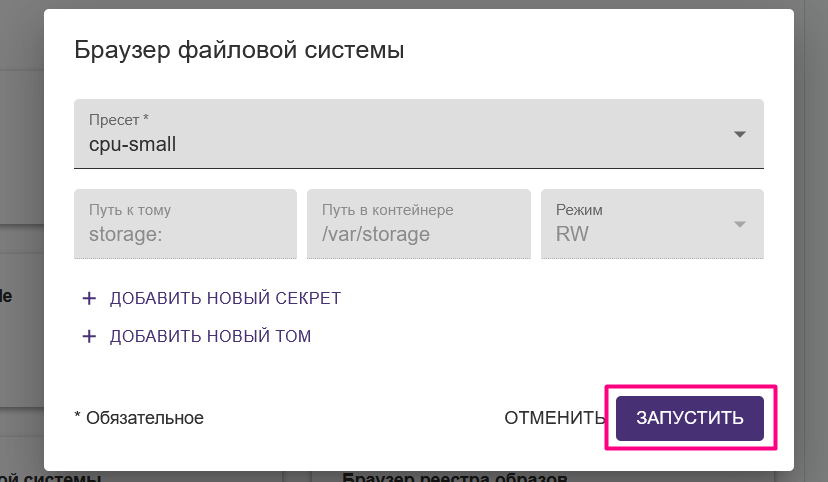

# Совместная разработка

## Введение

Как вы уже [знаете](getting-started.md#understanding-core-concepts), основными понятиями платформы являются _задания_, _сетевое хранилище_ и _рабочее окружение_.&#x20;

Вы можете поделиться заданием, дисковым пространством или образом на реестре платформы со своими коллегами по команде, предоставив им права на чтение, изменение или даже удаление таких сущностей.

Мы рекомендуем хранить код проекта в репозитории Git. В этом случае каждый член команды будет иметь локальную копию репозитория и сможет запускать задания независимо. Чтобы настроить свой проект, выполните действия, описанные далее.

## Создание нового проекта&#x20;

Сначала необходимо создать новый проект из шаблона. Чтобы сделать это, установите пакет cookiecutter и создайте новый проект платформы на его основе:

```
$ pipx install cookiecutter
$ cookiecutter gh:neuro-inc/cookiecutter-neuro-project --checkout release
```


Более подробно о создании новых проектов на базе шаблона можно [прочитать здесь](getting-started.md#sozdanie-novogo-proekta-cookiecutter).


## Сохранение проекта в git-репозитории

Теперь необходимо поместить новый проект в репозиторий Git. Следуйте инструкциям для Git-хостинга, который Вы выбрали (например, здесь приведены [инструкции для GitHub](https://help.github.com/en/github/importing-your-projects-to-github/adding-an-existing-project-to-github-using-the-command-line)).

## Обращение с данными

Существует несколько вариантов для хранения данных Вашего проекта в открытом для других пространстве.

### Сетевое хранилище платформы

Вы можете загрузить данные на сетевое хранилище, используя как CLI, так и Веб-интерфейс.&#x20;



Чтобы загрузить данные с помощью CLI, используйте команду `neuro cp`. Например:

```
$ neuro cp -r <локальный-каталог> storage:cifar-10
```

Это загрузит данные из вашего локального каталога в папку `cifar-10` на сетевое хранилище.



Чтобы загрузить данные с помощью Веб-интерфейса, вам для начала потребуется открыть Filebrowser. Для этого, нажмите **ЗАПУСТИТЬ** в виджете **Браузер файловой системы**:

.png>)

После этого, нажмите **ЗАПУСТИТЬ** в новом окне:



Когда Filebrowser будет открыт, перейдите в паку, в которую вы хотите загрузить данные и нажмите иконку **Upload**:

.png>)

Далее, выберите файлы или папку, которые вы хотите загрузить:

.png>)



После того, как ваши файлы будут загружены на сетевое хранилище, вы можете дать доступ к ним вашим коллегам. Доступ имплементирован немного по-разному в CLI и веб-интерфейсе.



Вы можете дать постоянный доступ к папкам и файлам с помощью CLI, используя команду `neuro share`.&#x20;

```
$ neuro share storage:cifar-10 alice manage
```

Это даст пользователю Alice доступ уровня `manage` к папке  `cifar-10` на сетевом хранилище (то есть, этот пользователь сможет просматривать, изменять и удалять файлы в этой папке).

После этого, вам нужно будет обновить значение `data/remote:` в файле `.neuro/live.yaml` вашего проекта, чтобы сохранить полный URI данных. Это позволит вашим коллегам использовать эту папку с данными в их копиях проекта (здесь, `default` - название кластера, использующегося по умолчанию, а `bob` - ваше имя на платформе):

```
  data:
    remote: storage://default/bob/cifar-10
    mount: /project/data
    local: data
```

После этого, ваши данные будут доступны в папке `/data` локальной файловой системы заданий, с которыми вы и ваши коллеги работаете.



С помощью Filebrowser можно давать временный доступ к файлам и папкам через Веб-интерфейс пользователям, у которых есть соответствующая ссылка.

Выберите в Filebrowser файлы и/или папки, к которым вы хотите дать доступ, и нажмите иконку **Share**:

.png>)

Далее, вы можете создатать временные или постоянные ссылки доступа к выбранным объектам. Чтобы создать постоянную ссылку, нажмите **Get Permanent Link**:

.png>)

Чтобы создать временную ссылку, укажите нужный срок действия ссылки инажмите иконку **Create**:

.png>)



### Области памяти (Buckets)

Вы можете использовать AWS или GCP buckets для сохранения ваших данных за пределами платформы. В этом случае необходимо добавить токен доступа в папку `config` проекта в соответствии с рекомендациями [AWS](https://docs.neu.ro/toolbox/accessing-object-storage-in-aws) или [GCP](https://docs.neu.ro/toolbox/accessing-object-storage-in-gcp). Обратите внимание, что Git не отслеживает эти токены, поэтому ваши коллеги  также должны поместить свои токены в свои локальные копии проекта.

### Публичные ресурсы

Ваши данные также могут быть доступны на каком-либо общедоступном ресурсе, который не требует аутентификации. В этом случае вы можете либо поместить копию данных на сетевое хранилище (см. выше), либо загружать данные в локальную файловую систему контейнера при каждом запуске (если размер данных относительно невелик).

## Настройка проекта и запуск заданий

Теперь все Ваши коллеги по команде могут клонировать проект и начать работу над ним в своих локальных копии. Вот некоторые шаги, которые каждый член команды должен выполнить самостоятельно.

* Чтобы настроить рабочую среду, запустите `neuro-flow build myimage` (это необходимый шаг, который нужно выполнять каждый раз, когда вы обновляете зависимости pip из файла `requirements.txt` или системные зависимости из `apt.txt`).&#x20;
* Чтобы запустить сеанс Jupyter Notebooks, выполните `neuro-flow run jupyter`. Файлы типа Notebook сохраняются в папке `<project>/notebooks` на сетевом хранилище. Чтобы скачать файл Jupyter Notebooks в локальную копию проекта, выполните `neuro-flow download notebooks`.
* Чтобы запустить обучение из исходного кода, сделайте следующие изменения для вашего задания `train` в файле `.neuro/live.yaml` и выполните команду `neuro-flow run train`. Например:

```
jobs:
    train:
    ...
    bash: |
        python $[[ volumes.code.mount ]]/train.py
```

Вы можете получить больше информации о функциональности проекта в файле `HELP.md` в папке Вашего проекта.

## Открытие доступа к работающему заданию

Вы можете открыть доступ к любым заданиям, которые вы выполняете на платформе.&#x20;

Для этого вам надо знать имя или ID требуемого задания. ID - уникальный идентификатор задания, в то время как имшия может повторяться для разных запусков одного и того же задания.

### Просмотр имён и ID заданий

Посмотреть имена и ID ваших запущенных заданий можно как в CLI, так и в Веб-интерфейсе.



Для просмотра списка запущенных заданий используется команда `neuro ps`.&#x20;

Вы также можете проверить статус конкретного задания с помощью команды `neuro status <моё-задание>`.



Имена и ID заданий отображаются в левой части секции **Задания**. Не забудьте установить фильтр заданий на значение **Работает**.

Вы можете посмотреть **Детали задания**, нажимая на его ID.

.png>)



### Предоставление доступа к заданиям



Для того, чтобы доть пользователю Alice доступ к заданию `jupyter-awesome-project` с `job-fb835ab1-5285-4360-8ee1-880a8ebf824c`, запустите следующую команду (`awesome-project` здесь - краткое название вашего проекта).

```
$ neuro share job:job-fb835ab1-5285-4360-8ee1-880a8ebf824c alice read
```

Вы также можете использовать имена заданий для предоставления доступа к ним:

```
$ neuro share job:jupyter-awesome-project alice read
```

Здесь нужно помнить, что разные запуски одного и того же задания могут иметь одинаковые имена.



Чтобы дать доступ к заданию, нажмите **Дать доступ** в выпадающем списке справа от него:

.png>)

Далее, введите имя пользователя, которому вы хотите дать доступ и желаемый уровень доступа. После этого нажмите **ДАТЬ ДОСТУП**:

.png>)



Данная команда позволит пользователю Alice получить доступ к заданию через его ID или полный URI, который состоит из имени кластера, имени владельца и имени или ID задания: `job://default/bob/jupyter-awesome-project`.

```
# read the logs
neuro logs job://default/bob/jupyter-awesome-project
neuro logs job-fb835ab1-5285-4360-8ee1-880a8ebf824c   

# run the interactive bash session:
neuro exec job://default/bob/jupyter-awesome-project bash  
neuro exec job-fb835ab1-5285-4360-8ee1-880a8ebf824c bash   

# open web interface in the default web browser:
neuro browse job://default/bob/jupyter-awesome-project 
neuro browse job-fb835ab1-5285-4360-8ee1-880a8ebf824c
```

Кроме того, пользователь получит доступ к этому заданию в своем [Веб-интерфейсе](https://app.neu.ro) и сможет отслеживать его логи или работать с ним там.

Обратите внимание, что если кто-то получит доступ на запись (`write`) к вашему заданию Jupyter Notebook, то он может изменять файлы Jupyter Notebooks на вашем сетевом хранилище. Поэтому, чтобы обновить эти файлы в репозитории Git, следует сначала загрузить их, а затем сделать commit и push.

Вы можете дать доступ к новому заданию, добавляя опцию  `--share <имя-пользователя>` во время его запуска.

Существует также краткая команда для предоставления доступа для членов вашей команды ко всем вашим заданиям (прошлым, текущим и будущим):

```
$ neuro share job: alice read
```

## Предоставление доступа к образу Docker

Наш проект содержит [базовое рабочее окружение](https://hub.docker.com/r/neuromation/base), которое мы рекомендуем использовать для большинства проектов. Данная среда основана на [deepo](https://github.com/ufoym/deepo). Она содержит последние версии популярных библиотек ML/DL (включая Tensorflow 2.0 и PyTorch 1.4). Когда Вы запускаете `neuro-flow build myimage`, в этой среде устанавливаются дополнительные зависимости, которые указаны в файлах `requirements.txt` и `apt.txt`, которые затем сохраняются в Docker-реестре платформы. В этом случае нет необходимости открывать доступ к образу коллегам, так как они в свою очередь могут создать аналогичный образ из той же кодовой базы.

Однако, в отдельных случаях, вы можете использовать другой образ Docker в качестве базового. Если этот образ общедоступен, то вам просто нужно будет обновить переменную `images/myimage/ref` в файле `.neuro/live.yaml` проекта:

```
images:
  myimage:
    ref: ufoym/deepo
```

Если образ не является общедоступным, вам нужно будет открыть к нему доступ коллегам:

```
# upload to your registry:
$ neuro image push project-specific-docker-image

# share with your teammates:
$ neuro share image:project-specific-docker-image alice read

# update the .neuro/live.yaml file with the full URI of your image:
images:
  myimage:
    ref: image://default/bob/project-specific-docker-image
```

Обратите внимание, что некоторые функции могут отсутствовать в пользовательских Docker-образах. В частности, вам может потребоваться залогиниться в AWS или GCP вручную из вашего рабочего задания.
