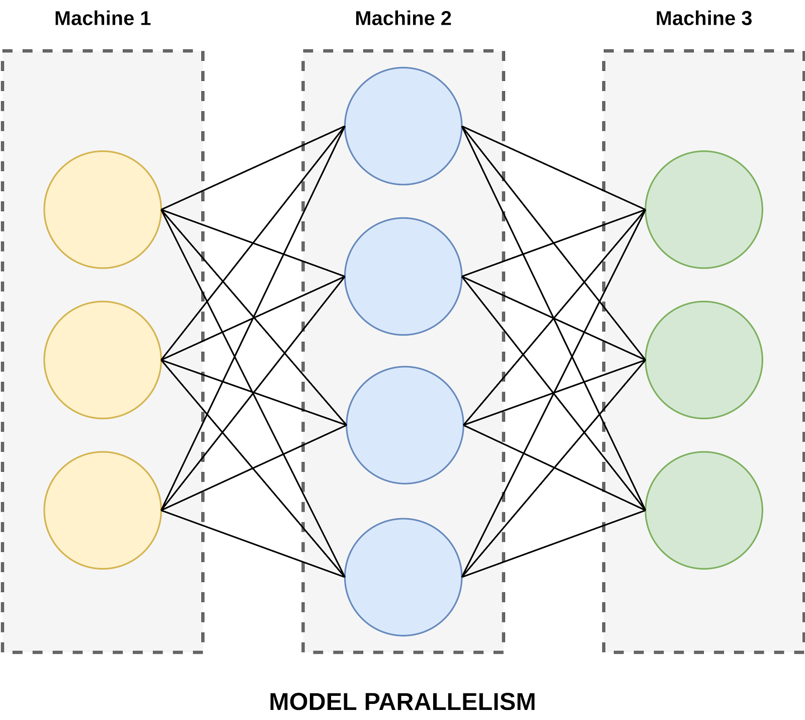
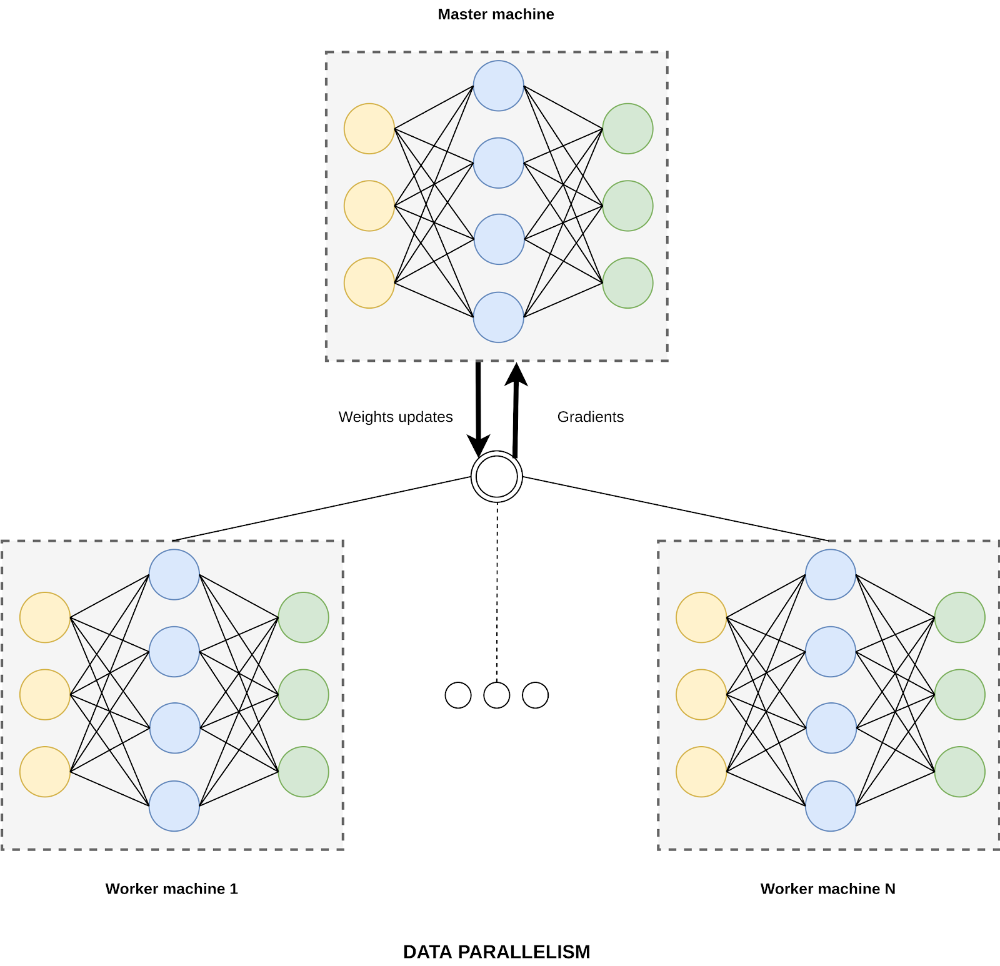

# Distributed Training in PyTorch

In this guide, we show how to run distributed training process in PyTorch on Neu.ro. You can find the details about the described [recipe](https://github.com/neuromation/ml-recipe-distributed-pytorch) in our blog post: [Distributed training in PyTorch - using an example from the TensorFlow 2.0 Question Answering Competition](https://blog.neu.ro/blog/distributed-training-in-pytorch-using-an-example-from-the-tensorflow-2-0-question-answering-competition/).

### Types of parallelism

#### Model Parallelism

For this type of parallelism, we divide the model into logical parts. These parts can be network layers or model components, such as decoder and encoder. The decomposition method is not essential for understanding this parallelism approach.

Each component is located on a different device and the calculations are performed sequentially.

With this approach, it's difficult to get any significant boost in training time, since all computations occur sequentially. We also have to take into account the overhead due to the massive transfer of data between devices.

It makes sense to use Model Parallelism in the case of training huge models that don't fit on one device even with a small batch size.

#### Data Parallelism

Unlike Model Parallelism, in this approach, small pieces of data are distributed between several devices, i.e., the batch is broken down into small pieces and processed independently by multiple copies of the same model.

The learning process organization is as follows. One of the devices is assigned to serve as a master device, the main task of which is to collect gradients for gradient descent from other devices and update the weights across all the copies of the model.

Data Parallelism is a universal method and is provided by most popular DL libraries for training (DistributedDataParallel in PyTorch), freeing users from the need to synchronize data between devices themselves.

### Try it for yourself

In our [repository](https://github.com/neuromation/ml-recipe-distributed-pytorch), we used the Data Parallelism approach. This repository contains a solution for the [TensorFlow 2.0 Question Answering competition](https://www.kaggle.com/c/tensorflow2-question-answering) held on Kaggle.

To download [Google’s Natural Questions](https://ai.google.com/research/NaturalQuestions/dataset) dataset and run our competition solution, you must accept the user agreement on Kaggle. In case you want to reuse our recipe as a template for doing distributed training on Neu.ro, we are also providing the `DummyDataset`, which does not require downloading any data.

To run the recipe on the `DummyDataset`, follow these simple steps:

1. [Sign up](https://neu.ro/) and [install CLI client](https://docs.neu.ro/getting-started#installing-cli)
2. Clone the [repository](https://github.com/neuromation/ml-recipe-distributed-pytorch)
3. Run \
   `neuro-flow build myimage`\
   `neuro-flow mkvolumes`\
   `neuro-flow upload ALL`
4. Run `scripts/run_distributed_on_platform.sh`

This approach is generic, so you can use our solution as a template for training your PyTorch models distributedly.
