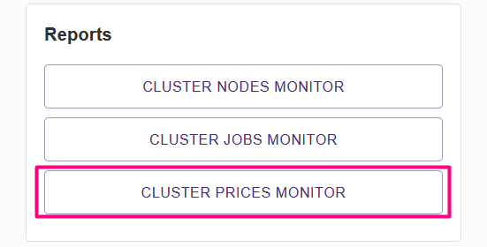

# Running Apache Spark workloads

## What is Spark?

Apache Spark is an open-source, distributed, multi-language data processing system. It can quickly perform processing tasks by utilization of in-memory caching, query execution optimization and other techniques while distributing workloads among multiple managed workers.

More information could be found at [https://spark.apache.org/](https://spark.apache.org/)

## Running on the platform

We allow our customers to run Spark workloads in various approaches:&#x20;

* as a collection of platform Jobs using apolo-flow (see dedicated repository [example](https://github.com/neuro-inc/mlops-spark))
* as a PySpark application with Driver within the Jupyter server (see[#jupyter-pyspark-k8s](running-apache-spark-workloads.md#jupyter-pyspark-k8s "mention"))
* as a PySpark application managed by [spark-on-k8s-operator](https://github.com/GoogleCloudPlatform/spark-on-k8s-operator)  (example yet to be added)

In later two cases, one should contact cluster manager in order to make required configurations an obtain Kubernetes credentials needed for Spark Driver. Those credentials are supplied as [kubectl config](https://kubernetes.io/docs/concepts/configuration/organize-cluster-access-kubeconfig/) file and should be mounted into the Driver job in expected path (`~/.kube/config`).

### Jupyter + PySpark + Kubernetes 

This section contains example of a user-flow for submitting workloads from Jupyter with PySpark into underlying Kubernetes cluster.&#x20;

_Prerequisite_: kubectl credentials file is obtained from the cluster manager and saved as `KUBECONFIG` platform secret. The secret name could be different, just make sure you select a proper secret during the first step.&#x20;

1. Launch **Jupyter Lab** (or Notebook) application from the **Dashboard** using pyspark-jupyter container image, attach kubectl config at `/root/.kube/config`.

<figure><figcaption>
Jupyter Lab job with PySpark configuration
</figcaption></figure>

2. Open Notebook and adjust PySpark context configuration with namespace, service account name and Kubernetes API endpoint provided by cluster manager.

<figure><figcaption>
Spark context configuration
</figcaption></figure>

3. Now you could start deploying Spark workloads to the underlying Kubernetes cluster.

<figure><figcaption>
Spark workload deployed and monitored in Kubernetes cluster 
</figcaption></figure>

4. Do not forget to tear down workers with `spark.stop()`

