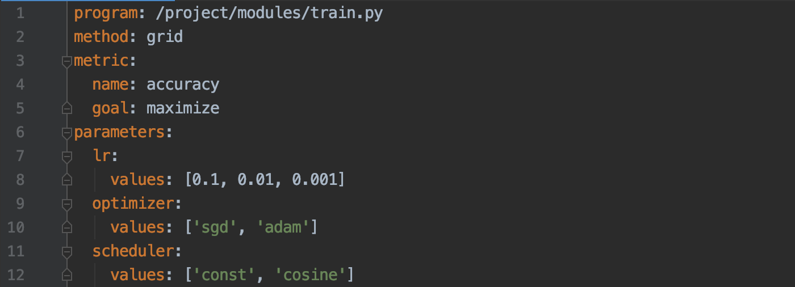

# Настройка гиперпараметров с Weights & Biases

Neu.ro позволяет проводить обучение модели параллельно с различными комбинациями гиперпараметров через интеграцию с [Weights & Biases](https://www.wandb.com/). W&B - это инструмент отслеживания экспериментов для глубокого обучения. Инженеру ML нужно только инициировать процесс: подготовить код для обучения модели, настроить пространство гиперпараметров и начать поиск только одной командой. Все остальное сделает Neu.ro.

Чтобы увидеть данное руководство в действии, ознакомьтесь с нашим [рецептом](https://github.com/neuromation/ml-recipe-hyperparam-wandb), в котором мы применяем настройку гиперпараметров W&B к задаче классификации изображений.

### Создание проекта Neu.ro

Шаблон проекта Neu.ro содержит интеграцию с Weights and Biases. Чтобы создать новый проект из шаблона, необходимо выполнить несколько шагов.

Сначала [зарегистрируйтесь](https://neu.ro/) и [установите клиент CLI](https://docs.neu.ro/getting-started#installing-cli)

Затем создайте проект:

```text
neuro project init
```

Эта команда задаст Вам несколько простых вопросов:

```text
project_name \[Neuro Project]: Hyperparameter tuning test
project_slug \[hyperparameter-tuning-test]:
code_directory \[modules]:
```

Нажмите `Enter` если вы не хотите менять предложенное значение.

Затем поменяйте рабочую директорию:

```text
cd hyperparameter-tuning-test
```

## Подключение Weights & Biases

Теперь подключите Ваш проект к [Weights & Biases](https://www.wandb.com/):

1. [Зарегистрируйтесь на W&B](https://app.wandb.ai/login?signup=true)
2. На странице  [W&B’s settings page](https://app.wandb.ai/settings) \(раздел “API keys”\) найдите Ваш API key \(он также называется токеном\). Он должен выглядеть таким образом: `cf23df2207d99a74fbe169e3eba035e633b65d94`.
3. Сохраните ваш API key \(токен\) в файле в локальном каталоге `./config/` и, чтобы сделать W&B доступным на платформе Neu.ro, установите соответствующие разрешения:

```text
export WANDB_SECRET_FILE=wandb-token.txt
echo "cf23df2207d99a74fbe169e3eba035e633b65d94" > config/$WANDB_SECRET_FILE
chmod 600 config/$WANDB_SECRET_FILE
```

Убедитесь, что Neu.ro может получить доступ и использовать этот файл для аутентификации:

```text
make wandb-check-auth
```

В случае успеха вывод команды должен быть таким:

```text
Weights & Biases will be authenticated via key file:
'/project-path/config/wandb-token.txt'.
```

Теперь Вы можете выполнять задания `develop`, `train`, `jupyter` или другие задания \(для полного списка команд см. `Makefile`\). Neuro будет аутентифицировать W&B через Ваш API key, запуская при старте задания `wandb login`.

Технически, аутентификация в W&B выполняется следующим образом: при запуске любого задания в среде, производной от базовой, Neu.ro проверяет, установлена ли переменная среды `NM_WANDB_TOKEN_PATH` и затем сохраняет путь к существующему файлу. Затем \(до запуска задания\), чтобы создать соединение между W&B и Neu.ro, запускается команда `wandb login $(cat $NM_WANDB_TOKEN_PATH)`.

Инструкции по использованию Weights & Biases в Вашем коде Вы найдете в документации [W&B documentation](https://docs.wandb.com/library/api/examples) и в примерах [W&B example projects](https://github.com/wandb/examples).

## Использование Weights & Biases для настройки гиперпараметра

Если Вы выполнили предыдущие части данного руководства, W&B готово к использованию. Чтобы запустить настройку гиперпараметра для модели, Вам необходимо:

* определить список гиперпараметров \(в файле `wandb-sweep.yaml`\), и
* отправлять метрики в W&B после каждого запуска \(используя `Makefile` и команду `make hypertrain`\).

`Makefile` и `wandb-sweep.yaml` ссылаются на `train.py`. Если Вы хотите запустить `hypertrain` для другого скрипта, вы можете изменить характеристику `program` в `wandb-sweep.yaml` \(см. ниже\). Скрипт должен содержать описание модели и цикл обучения.

Скрипт Python также должен получать параметры в качестве аргументов командной строки с такими же именами, как указано в `wandb-sweep.yaml` и использовать их для обучения/оценки модели. Например, Вы можете использовать параметры командной строки, как в модуле Python [argparse](https://docs.python.org/3/library/argparse.html).

Более подробная информация:

1. `train.py` - это файл, содержащий код для обучения модели. В нем должны логироваться метрики из W&B, например, в нашем случае:

```text
wandb.log({'accuracy': 0.9})
```

1. `wandb-sweep.yaml` имеет следующую структуру:



* Line 1: `/../train.py` путь по умолчанию к файлу с обучающим кодом модели.
* Line 2: метод, который используется для настройки гиперпараметров. Для получения дополнительной информации см. документы W&B.
* Lines 4, 5: имя метрики, которая должна быть оптимизирована. Инженер ML может изменить метрику в соответствии с заданием.
* Lines 6 -12: настройки гиперпараметров. Их необходимо использовать в файле `train.py`. Имена, значения и диапазоны могут быть изменены.

Имя файла `wandb-sweep.yaml` и путь к нему можно изменить в Makefile в корневом каталоге Вашего проекта.

## Настройка гиперпараметра

Теперь, когда Вы настроили Neu.ro и W&B и подготовили скрипт для обучения модели, можно попробовать сделать настройку гиперпараметров. Для этого необходимо выполнить следующую команду:

```text
make hypertrain
```

Данная команда выполняет параллельно задания, которые приводят в действие скрипт `train.py` \(или с любым другим, выбранным Вами именем\), с различными наборами гиперпараметров. По умолчанию одновременно выполняется только 3 задания. Вы можете изменить это число, изменив переменную `N_JOBS` в файле `Makefile` или добавив ее в конце команды `make`:

```text
make hypertrain N_JOBS=10
```

Чтобы отслеживать процесс настройки гиперпараметров, перейдите по ссылке, которую W&B предоставляет в начале работы.

Если вы хотите остановить настройку гиперпараметров, прекратите все связанные задания:

```text
make kill-hypertrain-all
```

Убедитесь, что задания остановлены \(`make ps`\), а затем удалите неиспользуемые развертки из локального файла `.wandb_sweeps`.

