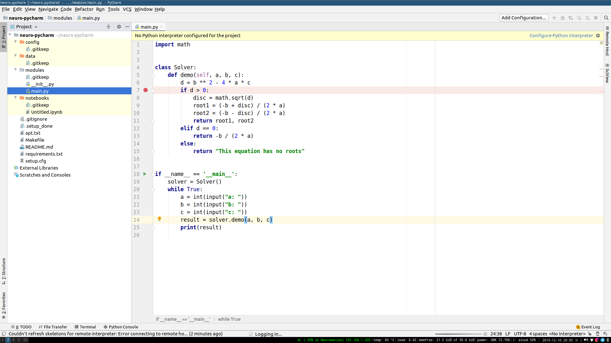
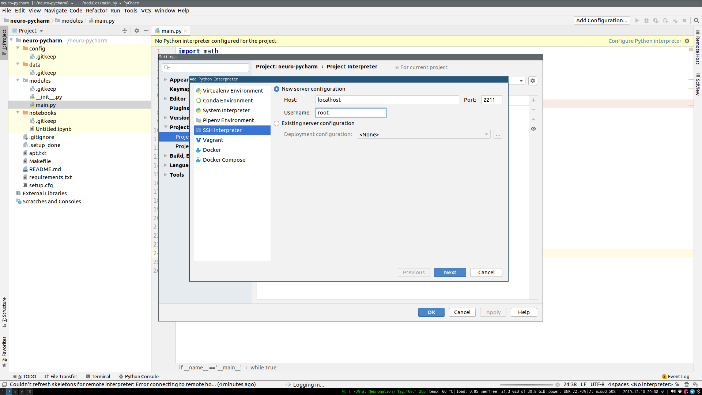
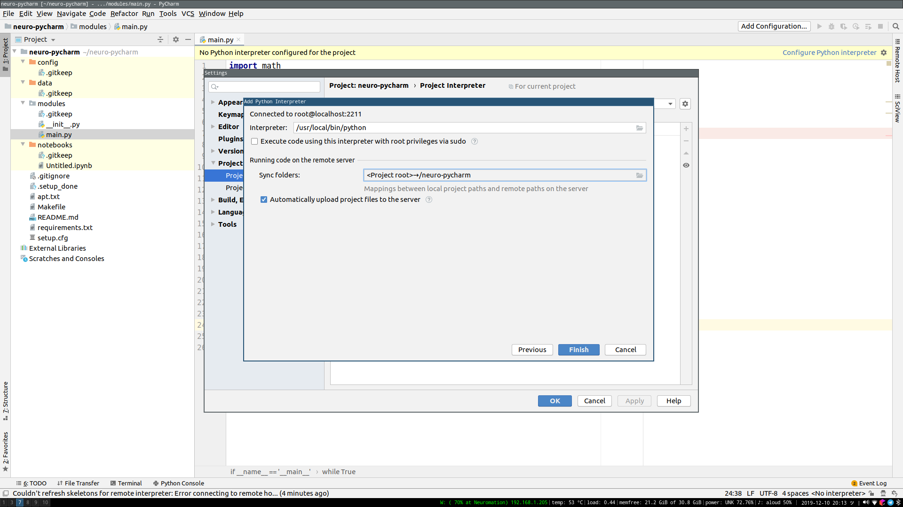
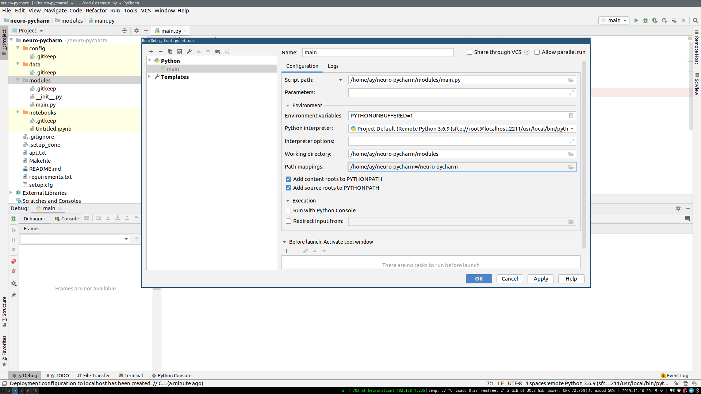

# Удаленная отладка с помощью PyCharm Professional

## Введение

В данном руководстве мы покажем, как настроить удаленную отладку с помощью PyCharm Professional на платформе, используя шаблон проекта.

## Создание нового проекта

Во-первых, убедитесь, что у вас установлен и настроен клиент платформы:

```bash
pip install -U neuromation
neuro login
```

Затем создайте пустой проект::

```bash
neuro project init
```

Эта команда задаст несколько вопросов о Вашем проекте:

```text
project_name [Name of the project]: Neuro PyCharm
project_slug [neuro-pycharm]: 
code_directory [modules]:
```

Далее настройте на платформе рабочее окружение проекта:

```bash
make setup
```

## Настройки PyCharm

Откройте проект, созданный на предыдущем шаге в Pycharm Professional и добавьте пример кода для отладки \(в этом примере мы используем фрагмент кода, взятый из документации [JetBrains documentation](https://www.jetbrains.com/help/pycharm/remote-debugging-with-product.html)\).

Затем, _исключите все каталоги, которые не содержат код Python_ \(в пустом проекте Neuro только в `modules/` может быть код\). PyCharm не синхронизирует исключенные каталоги. Для этого выберите все каталоги, которые нужно исключить, щелкните правой кнопкой мыши "Mark Directory as" -&gt; "Excluded". В результате вы увидите сконфигурированный проект:



Теперь все готово, чтобы приступить к разработке на GPU в платформе. Выполните команду в shell:

```bash
make develop
```

Данная команда запускает `develop` задание на платформе, используя настройки `gpu-small`. Все запущенные задания потребляют Вашу квоту, поэтому, пожалуйста, _не забудьте прекратить работу_ когда она больше не нужна \(для этого вы можете выполнить `make kill-all`\).

Теперь перенаправьте SSH-порт задания на localhost::

```bash
make port-forward-develop
```

Обратите внимание, если порт по умолчанию `2211` недоступен, Вы можете указать другой порт через `make port-forward-develop LOCAL_PORT=2212`.

Теперь вернитесь в проект, перейдите "File" -&gt; "Settings", "Project" -&gt; "Project interpreter" \(можно использовать поиск по слову "interpreter"\). Чтобы увидеть опции интерпретатора проекта, нажмите на значок шестеренки, выберите "Add...". В новом окне выберите "SSH Interpreter" и настройте следующую конфигурацию:

```bash
Host: localhost
Port: 2211
Username: root
```



Нажимте кнопку Next.

В новом окне укажите пути:

```bash
Interpreter: /usr/local/bin/python
Sync folders: <Project root> -> /neuro-pycharm
```

Обратите внимание, что в рамках задания, корень вашего проекта доступен в корне файловой системы: `/{project_name}`

Нажмите кнопку Finish и Ваша конфигурация готова:



Нажмите кнопку OK.

Как только вы примените конфигурацию удаленного интерпритатора, PyCharm начнет синхронизацию файлов.

Поздравляем! Ваш PyCharm проект теперь настроен для работы с удаленным интерпретатором Python, работающим с заданием платформы:


Примечание: если mapping проекта не был настроен, и удаленный интерпретатор пытается выполнить файл с локальным путем в удаленной среде, Вам может потребоваться указать mapping опять: "Run" -&gt; "Edit Configurations..." -&gt; "Path mappings":



