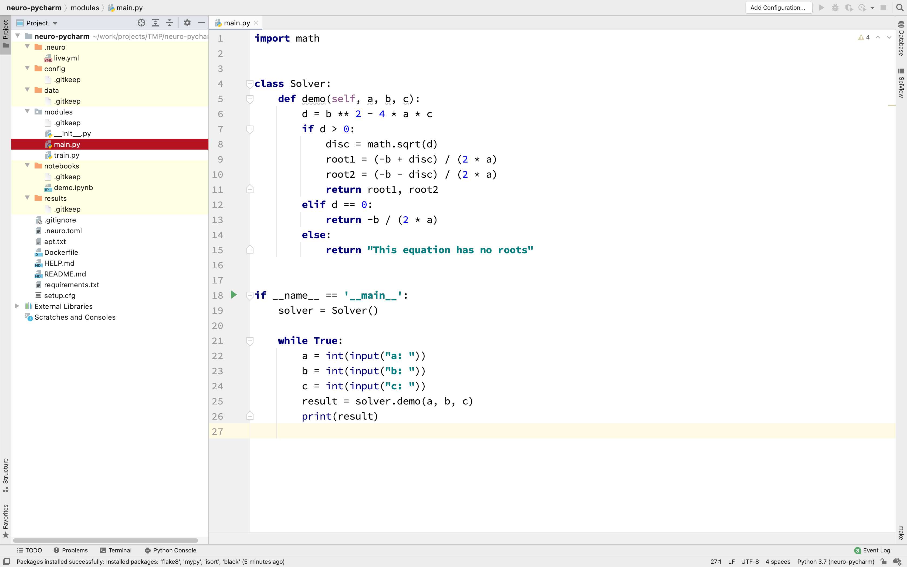
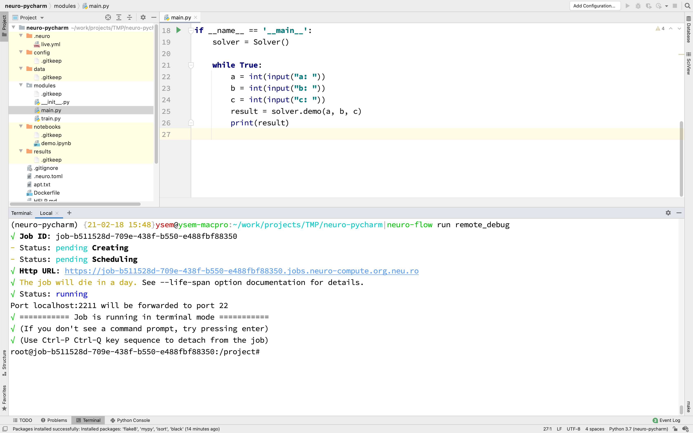

# Удаленная отладка с помощью PyCharm Professional

## Введение

В данном руководстве вы узнаете, как настроить удалённую отладку с помощью PyCharm Professional на платформе, используя шаблон проекта.

## Создание нового проекта

Во-первых, убедитесь, что у вас установлен и настроен клиент Neu.ro CLI:

```bash
> pip install -U neuro-cli neuro-flow
> neuro login
```

Затем создайте пустой проект:

```bash
> neuro project init
```

Эта команда задаст несколько вопросов о вашем проекте:

```text
project_name [Name of the project]: Neuro PyCharm
project_slug [neuro-pycharm]: 
code_directory [modules]:
```

Далее, перейдите в папку нового проекта и настройте на платформе рабочее окружение проекта:

```bash
> cd neuro-pycharm 
> neuro-flow build myimage
```

## Настройка PyCharm

Откройте только что созданный проект в PyCharm Professional и добавьте пример кода для отладки как новый файл `main.py` в папке `modules` \(в этом примере мы используем фрагмент кода из документации [JetBrains documentation](https://www.jetbrains.com/help/pycharm/remote-debugging-with-product.html)\).

Затем, исключите все каталоги, которые не содержат код Python \(в пустом проекте код будет только в папке `modules`\). PyCharm не синхронизирует исключенные каталоги. Выберите все каталоги, которые нужно исключить, щелкните правой кнопкой мыши и выберите **Mark Directory as** -&gt; **Excluded**. В результате вы увидите настроенный проект:



Выполните следующие команды, чтобы загрузить ваш код на дисковое пространство платформы:

```bash
> neuro-flow mkvolumes
> neuro-flow upload ALL
```

Теперь вы можете запустить задание по разработке на GPU на платформе. Выполните следующую команду:

```bash
> neuro-flow run remote_debug
```



Данная команда запускает задание `remote_debug` на платформе. Это задание будет использовать пресет кластера по умолчанию и пробросит локальный порт 2211 к порту SSH задания. Все запущенные задания потребляют Вашу квоту, поэтому, пожалуйста, _не забудьте прекратить работу заданий,_ когда они больше не нужны. Для этого можно выполнить `neuro-flow kill remote_debug` \(это остановит задание, созданное на прошлом шагу\) или `neuro-flow kill ALL` \(это остановит все ваши задания\).

Теперь вернитесь в проект PyCharm и перейдите в **Preferences** -&gt; **Project** -&gt; **Project interpreter** \(также можно использовать поиск по слову "interpreter"\). Чтобы увидеть опции интерпретатора проекта, нажмите на **иконку шестеренки** и выберите **Add...** В новом окне выберите **SSH Interpreter** и установите такую конфигурацию:

* Host: _localhost_
* Port: _2211_
* Username: _root_


Далее нажмите **Next**.

В новом окне укажите пути интерпретатора и синхронизирующихся папок:

```bash
Interpreter: /opt/conda/bin/python
Sync folders: <Project root> -> /neuro-pycharm
```

Обратите внимание, что в рамках задания, корневая папка вашего проекта доступна в корне файловой системы: `/{project_name}`

Нажмите **Finish** и настройка будет закончена:


Нажмите **OK**.

Как только вы примените конфигурацию удаленного интерпретатора, PyCharm начнет синхронизацию файлов.

Ваш проект PyCharm теперь настроен для работы с удаленным интерпретатором Python, работающим из задания на платформе.

## Отладка

В данном примере мы работаем с файлом `main.py`. Чтобы войти в режим отладки, щелкните правой кнопкой мыши на файле и нажмите **Debug 'main'**:


Теперь вы можете взаимодействовать с файлом в режиме отладки:



Примечание: если mapping проекта не был настроен, и удаленный интерпретатор пытается выполнить файл с локальным путем в удаленной среде, вам может потребоваться заново указать mapping.  Вы можете это сделать в **Run** -&gt; **Edit Configurations...** -&gt; **Path mappings**:



