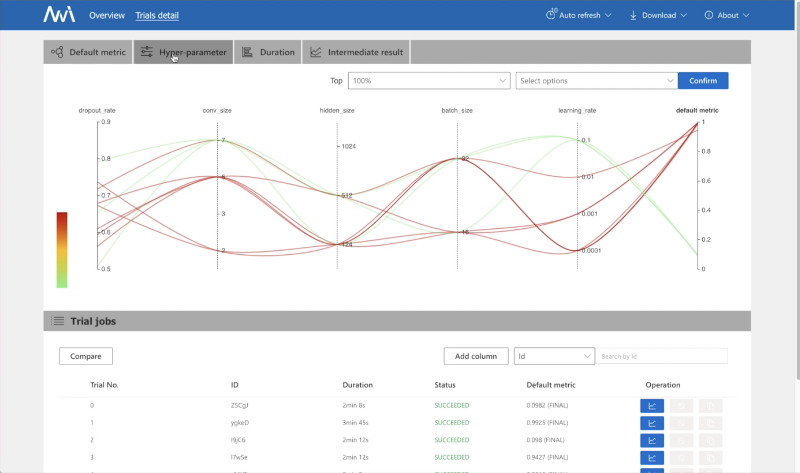

# Hyperparameter Tuning with NNI

## Introduction

This tutorial demonstrates how to use [NNI](https://github.com/microsoft/nni) \(an open-source tool from Microsoft\) for Hyperparameter Tuning on Neu.ro. You will create a new Neu.ro project, integrate it with NNI and run multiple tuning workers to speed up search process.



Make sure you have [Neu.ro CLI](../getting-started.md#installing-cli) installed.

### Creating Neu.ro project

To create a new Neu.ro project, run:

```bash
neuro project init
cd <project-slug>
```


Make sure you do not run `make setup` just yet. We're going to modify several files before building an image for the experiment.


### Populating experiment code and integrating with Neu.ro

We're going to use [NNI example code](https://github.com/microsoft/nni/tree/master/examples/trials/mnist-tfv2) with a MNIST dataset. Put [mnist.py](https://github.com/microsoft/nni/blob/master/examples/trials/mnist-tfv2/mnist.py) file to the `modules` folder and [search\_space.json](https://github.com/microsoft/nni/blob/master/examples/trials/mnist-tfv2/search_space.json) to the `config` folder.

Then, add the following lines to `requirements.txt`:

```bash
# Required for Hyper-parameter search
nni==1.5
# Required by Neu.ro NNI integration scripts
Jinja2>=2.11.2
aiodns>=2.0.0
```

We are now ready to build our image:

```bash
make setup
```

While Docker builds our image we can continue setting up NNI integration:

Put [nni.mk](https://github.com/neuromation/ml-recipe-nni/blob/master/nni.mk) to the root of your project and add the following line _at the end_ of`Makefile`:

```bash
include nni.mk
```

This will add some new make targets and overwrite existing ones to work with NNI.

Finally, put [`nni-config-template.yml`](https://github.com/neuromation/ml-recipe-nni/blob/master/config/nni-config-template.yml) and [`prepare-nni-config.py`](https://github.com/neuromation/ml-recipe-nni/blob/master/config/prepare-nni-config.py) to the `config` folder.

Once `make setup` completes, your project is ready for running on Neu.ro.

### Running the tuning jobs

The only thing left is to run

```bash
make hypertrain
```

This command will:

* Run 3 worker nodes with `gpu-small` preset. Both parameters can be configured via `N_JOBS` and `PRESET` parameters respectfully.
* Run master node with `cpu-small` preset.
* Auto-generate NNI configuration file for the master node pointing at the workers.
* Run the training process and open NNI web interface in your browser automatically.

From the web UI you can track experiment progress and intermediate results. When the workers are done, you can get final hyperparameter values and download the logs if needed.



Once you're done you can shutdown both the workers and the master node via:

```bash
make kill-hypertrain
```

