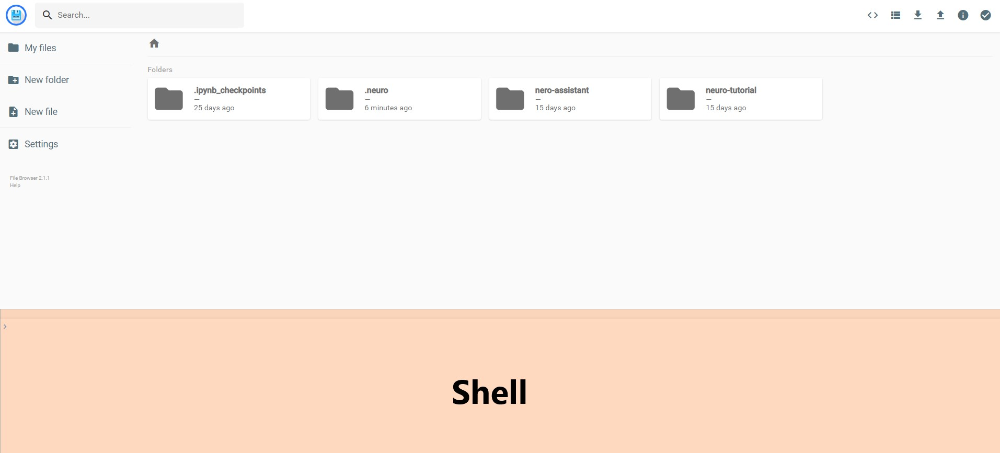
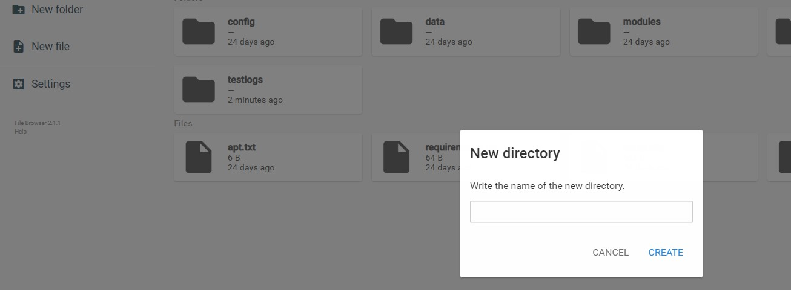
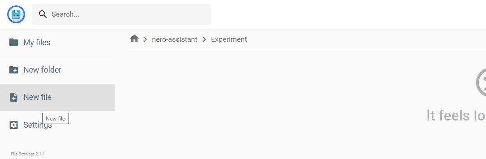
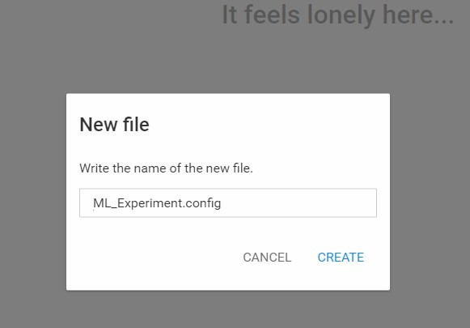
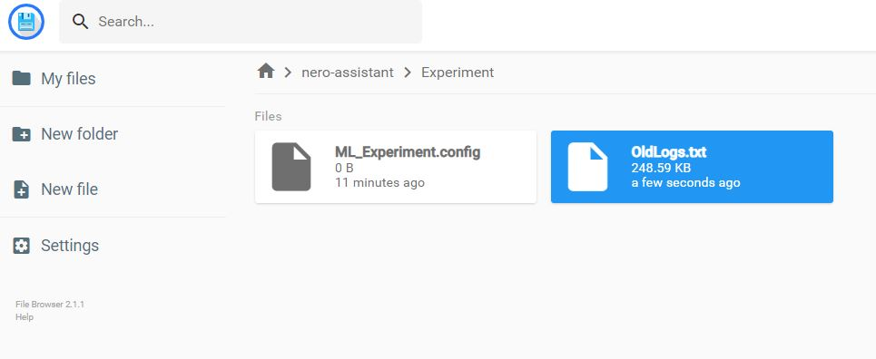
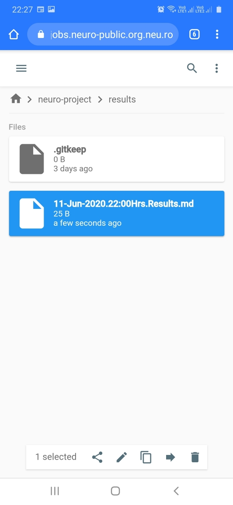
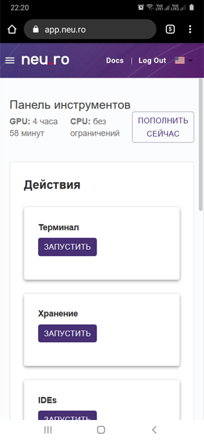
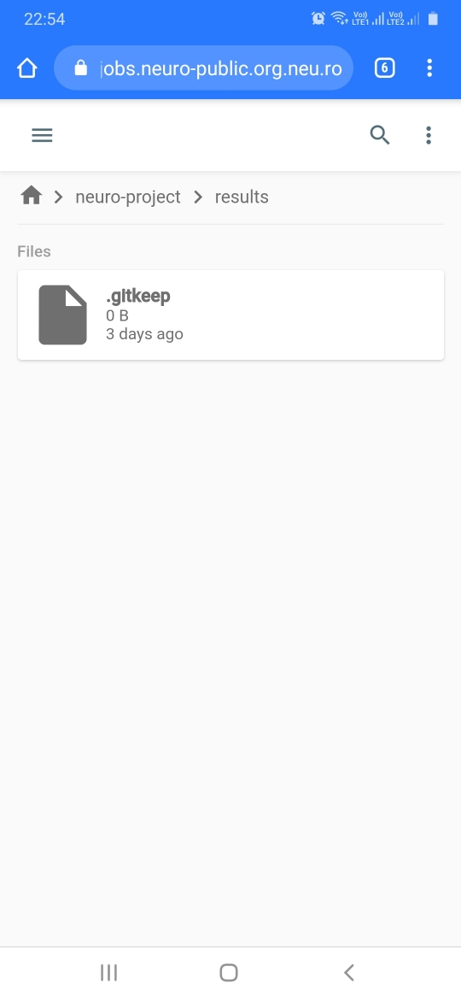
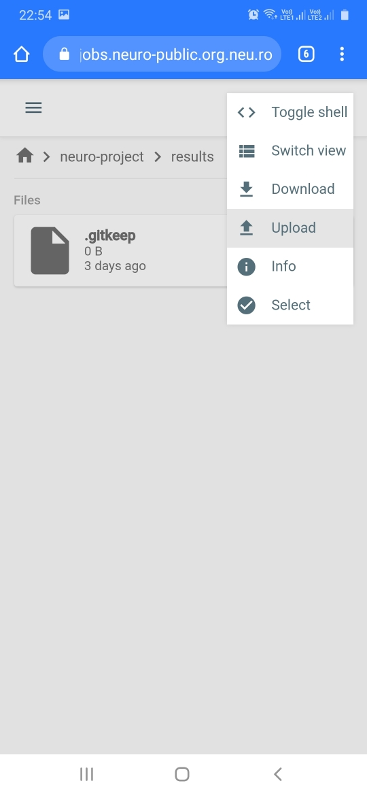

# FileBrowser

## Введение

FileBrowser - это интуитивно понятный веб-интерфейс, используемый для управления файлами и папками. FileBrowser основан на популярной программе просмотра файлов, доступной на [git](https://github.com/filebrowser/filebrowser). При помощи FileBrowser можно:

* [Создавать файлы и папки](filebrowser.md#creating-files-and-folders)
* [Загружать файлы и папки](filebrowser.md#downloading-files-and-folders)

Чтобы запустить FileBrowser: 

* Войдите в панель инструментов Neu.ro.
* Нажмите **ЗАПУСТИТЬ** в виджете Хранение.

* Выберите настройку из выпадающего списка и нажмите **ЗАПУСТИТЬ**.

Экземпляры FileBrowser это задания, которые перечислены в окне «Jobs» `Neu.ro` с тегом `kind:web_widget target:filebrowser`. Файловая система платформы смонтирована в директории /var/storage, которая также является каталогом root, в котором сохраняются все файлы.

Пользовательский интерфейс FileBrowser имеет следующие области:

* **Инструменты:** Отображает список действий, которые вы можете выполнить. Также имеет дополнительные опции при выборе файла или папки, такие как копирование, переименование, предоставление доступа, перемещение, удаление.
* **Опции:** Отображает дополнительные опции, такие как My Files \(домашняя станица\), New Folder, New File и Settings.
* **Папки и файлы:** Отображает содержимое текущей папки.

Нажав на кнопку переключения на командную оболочку , Вы также можете использовать Shell из FileBrowser и запускать команды из командной строки.

После того, как Вы закончите работу с FileBrowser, убедитесь, что Вы закрыли задания, связанные с ним.

Все задания FileBrowser автоматически уничтожаются через 24 часа.

## Создание файлов и папок

Вы можете создавать файлы и папки из FileBrowser. При создании файлов FileBrowser предоставляет текстовый редактор, посредством которого можно добавить содержимое в файл. Тем не менее, рекомендуется загружать файлы, а не создавать их.

**Для создания папки:**

* В области Option в FileBrowser нажмите на кнопку **New Folder**. 

* Введите наименование новой папки.

 

**Для создания файла:**

* В области Option в FileBrowser нажмите на кнопку **New File**. 

* Введите наименование нового файла.

  

* После ввода содержимого нажмите **Save**.

 

**Для загрузки файла:**

* На панели инструментов нажмите кнопку **Upload**. 

* Выберите файл, который Вы хотите загрузить. Файл будет загружен. Можно отредактировать файл, нажав на кнопку **Edit**. 

## Загрузка файлов и папок

Через FileBrowser, используя кнопку Download, возможно загрузить файлы, папки или всю файловую систему.

**Для загрузки файлов и папок:**

* Перейдите в папку или каталог с файлами и нажмите кнопку **Download**. Если не будет выбрано ни одного файла, то будет загружена вся текущая папка.

 

* Если Вы загружаете папку, то выберите формат, в котором она будет загружена. 

## Управление файлами и папками с мобильных устройств

Neu.ro обеспечивает полную поддержку мобильных устройств. Вы можете получить доступ к neu.ro и FileBrowser с любого мобильного устройства для просмотра, загрузки, выгрузки и управления файлами. Например, вы можете загрузить образцы изображений для рецепта [**Object Detection**](https://docs.neu.ro/cookbook/object-detection) ML с Вашего мобильного устройства.

**Для загрузки файлов на Ваше мобильное устройство:**

* Войдите в `neu.ro` и запустите FileBrowser.

 

* Перейдите в какую-либо папку и выберите файл или папку, которую Вы хотите загрузить.

 

* Выберите **Download** из меню параметров.

 

Файл будет загружен на Ваше мобильное устройство.

**Для загрузки файлов из Вашего мобильного устройства:**

* Войдите в `neu.ro` и запустите FileBrowser.

 

* Перейдите в папку, в которую Вы хотите загрузить файлы со своего мобильного устройства, и выберите **Upload** из меню Options.

 

* Перейдите в папку, откуда Вы хотите загрузить файл и выберите файл.

Файл будет загружен с Вашего мобильного устройства.

