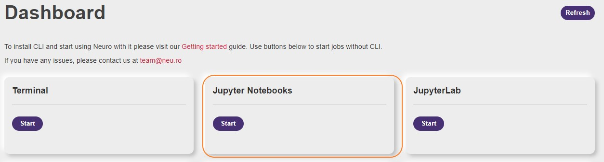
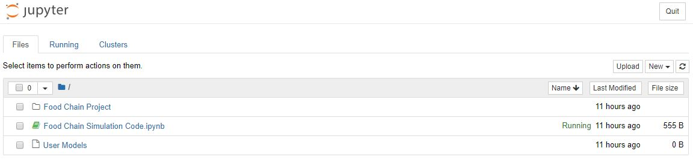
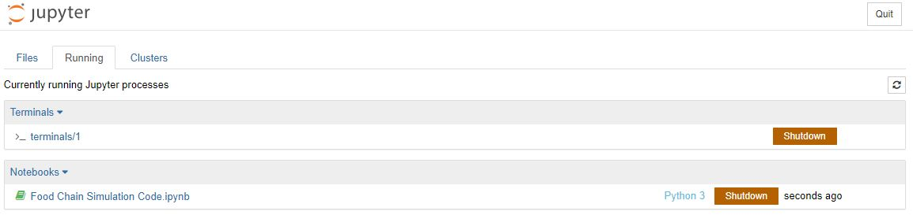
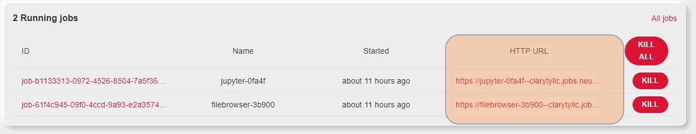
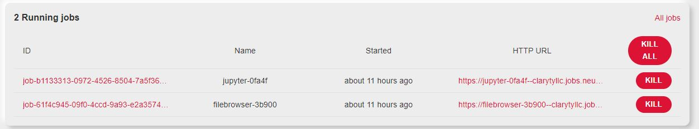
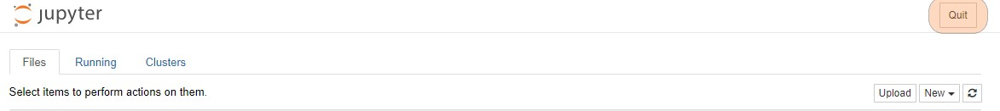

# Jupyter Notebooks

Jupyter Notebook - это мощный вычислительный инструмент, который позволяет создавать и делиться своим кодом. Neu.ro позволяет управлять всеми аспектами Jupyter Notebook с помощью интуитивно понятной веб-панели.

## Введение

В данном руководстве показано, как запустить экземпляр Jupyter Notebook в веб-интерфейсе Neu.ro. Вы запустите новый экземпляр Jupyter Notebook и создадите экземпляр Python 3. Вы также узнаете, как посмотреть или прекратить работу запущенного экземпляра.

## Создание нового экземпляра Jupyter Notebook

Neu.ro позволяет создавать несколько экземпляров Jupyter Notebook.

**Для создания нового экземпляра Jupyter Notebook:**

1. Войдите в панель управления Neu.ro.
2. Нажмите **Start** в разделе Jupyter Notebooks.

Новый экземпляр Jupyter Notebook будет запущен в новой вкладке.

Экземпляр не прекращает работу при закрытии вкладки. Вы всегда можете открыть экземпляр с панели инструментов Neu.ro. Однако, экземпляр прекращает работу автоматически через 24 часа после инициализации.

Новый экземпляр представляет собой мощный событийно-управляемый Jupyter Notebook, который сохраняет каждое внесенное Вами изменение. Все новые экземпляры работают на видеокарте [NVIDIA](https://www.nvidia.com/en-gb/data-center/tesla-k80/) [Tesla K80](https://www.nvidia.com/en-gb/data-center/tesla-k80/), что гарантирует отличную производительность. Ядро Notebook включает в себя список установленных pip пакетов, таких как [TensorFlow](https://www.tensorflow.org/) 2.0 и [PyTorch](https://pytorch.org/) 1.2. Вы можете просмотреть полный список установленных пакетов, выполнив команду `pip list` в терминале.

Notebook имеет три вкладки:

* **Files:** Позволяет управлять файлами в экземпляре Jupyter. Все дисковое пространство платформы Neu.ro доступно для размещения и управления файлами в Notebook.

Вы можете выбрать файл для выполнения над ним контекстных действий, таких как завершение работы, дублирование кода, переименование или загрузка текстовых файлов.

* **Running:** Перечисляет список терминалов и Python notebooks с последним статусом. Вы также можете выключить терминал или ноутбук в вкладке.

* **Clusters:** Позволяет управлять кластерами ноутбуков, к которым у вас есть доступ. В настоящее время кластеры предоставляются как [IPython parallel](https://github.com/ipython/ipyparallel).

## Управление экземплярами Jupyter Notebook

Вы можете управлять своими экземплярами JupyterLab с панели инструментов Neu.ro. Экземпляры JupyterLab перечислены в разделе Running Jobs, а их URL-адреса начинаются с [http://jupyter-](http://jupyter-). Чтобы открыть экземпляр, надо нажать на URL.

Чтобы посмотреть подробную информацию об экземпляре JupyterLab, необходимо нажать на ID задания.

Чтобы открыть экземпляр:

* Надо нажать на кнопку Open в разделе Jupyter Notebooks.

* Нажать на URL экземпляра.

Экземпляр указан как задание в информационной панели Neu.ro. Можно закончить работу экземпляра из раздела Running Jobs на панели инструментов. Обратите внимание, что закрытие вкладки не прекращает работу экземпляра.

Кроме того, Вы можете прекратить работу экземпляра, нажав на кнопку Quit внутри экземпляра.

Экземпляр автоматически завершает работу через 24 часа после инициализации.

