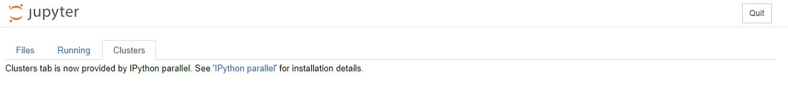

# Jupyter Notebooks

Jupyter Notebooks is a powerful computational notebook tool that lets you create and share your code. Neu.ro lets you manage all aspects of your Jupyter Notebooks from an intuitive web-based dashboard.

## Introduction

This tutorial demonstrates how to run a Jupyter Notebook instance in the Neu.ro Web UI. You will start a new instance of Jupyter Notebook and create a Python 3 notebook. You will also know how to view or kill currently running instances.

## Create a new Jupyter Notebook instance

Neu.ro lets you create multiple instances of Jupyter Notebooks.

**To create a new Jupyter Notebook instance:**

* Log in to your Neu.ro dashboard.
* Click **RUN A JOB** in the IDEs widget.

* Select Jupyter Notebooks in the top drop-down menu, a preset in the bottom drop-down menu, and click **RUN**.

A new Jupyter Notebook instance is launched in a new tab.

The new instance is a default Readme notebook that provides some information on how to start working with Jupyter Notebooks. Every new instance, including this one, will be a powerful event-driven Jupyter notebook that saves every change you make. All new instances run on [NVIDIA](https://www.nvidia.com/en-gb/data-center/tesla-k80/)[Tesla K80](https://www.nvidia.com/en-gb/data-center/tesla-k80/) video card that guarantees great performance. The notebook kernel includes a list of installed pip packages such as [TensorFlow](https://www.tensorflow.org/) 2.0 and [PyTorch](https://pytorch.org/) 1.2. You can view the complete list of installed packages by running the `pip list` command in the terminal.

To view the current notebook's Dashboard, click **Open...** in the **File** drop-down menu.

The notebook has three tabs:

* **Files:** Lets you manage the files in the Jupyter instance. The entire Neu.ro platform storage is available for you to host and manage files on the notebook.

You can perform context-based actions on selected files, such as Shutdown or Duplicate for code files and Rename or Download for text files.

* **Running:** Lists terminals and Python notebooks updated with the latest status. You can also shut down terminals and notebooks from this tab.

* **Clusters:** Lets you manage the notebook clusters that you have access to. Currently, clusters are provided by [IPython parallel](https://github.com/ipython/ipyparallel).

## Manage your Jupyter Notebook Instances

You can manage your Jupyter Notebook instances from the Neu.ro dashboard. The Jupyter Notebook instances are listed in the Running Jobs section, and their names start with _**jupyter-**_. 

You can view the details of your Jupyter Notebook instances by clicking on the corresponding job ID.

You can open an instance by clicking **HTTP URL**:

* In the Running Jobs section on your Dashboard.

* In the drop-down menu for the corresponding job in the job list.

You can kill the Jupyter Notebooks instance using the same drop-down menu. Note that closing the tab with the instance does not kill it.

Alternatively, you can kill the instance by clicking the Quit button within the instance.

An instance is automatically terminated 24 hours after initiation.

