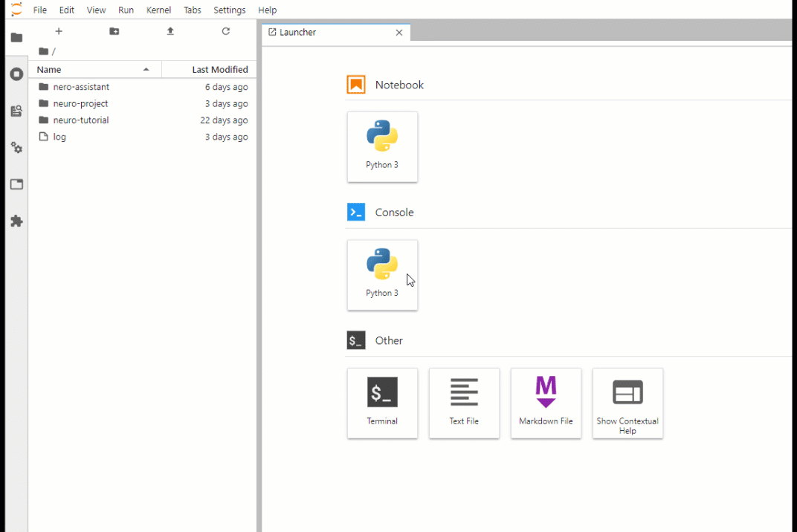

# JupyterLab

Jupyter Notebooks - это мощный вычислительный инструмент, который позволяет вам создавать и делиться своим кодом. JupyterLab использует Jupyter Notebook и делает немного больше. JupyterLab - это интерактивная веб-среда разработки для работы с Jupyter Notebooks, текстовыми редакторами, терминалами и пользовательскими компонентами.

Используя вкладки и разделители, Вы можете использовать несколько блокнотов, документов и других инструментов в одном интерфейсе. Кроме того, JupyterLab имеет модульную расширяемую архитектуру, которая позволяет настраивать среду разработки. Jupyter Notebook - это только один из компонентов, с которым Вы можете работать в JupyterLab.

**Для запуска экземпляра JupyterLab:**

* Войдите в панель инструментов Neu.ro.
* Нажмите **ЗАПУСТИТЬ** в виджете IDEs.

* Выберите Jupyterlab в верхнем выпадающем списке, настройку в нижнем выпадающем списке и нажмите **ЗАПУСТИТЬ**.

Когда вы запускаете JupyterLab, дисковое пространство платформы подключается к /var/storage. Все данные, созданные во время сеанса сохраняются и могут быть использованы позже.

Все экземпляры JupyterLab - это задания, которые выполняются с пресет GPU-small. Необходимо закрыть сеанс JupyterLab, когда работа будет закончена, иначе будут потребляться часы GPU. 

Пользовательский интерфейс Jupyter имеет следующие области:

* Инструменты: Здесь перечислены наиболее часто используемые команды.
* Рабочая область: Содержит ярлыки для запуска и вкладки, над которыми Вы сейчас работаете.
* Меню: Включает в себя все доступные опции JupyterLabs.

В области инструментов перечислено множество параметров, доступных в JupyterLabs, таких как:

* File Browser для управления файлами.
* Sessions для управления списком активных сессий.
* Commands для просмотра команд, доступных в текущем состоянии.
* Properties для управления свойствами для текущего выбора.
* Tabs для просмотра списка открытых вкладок.
* Extension Manager для включения и управления расширениями.

Для получения дополнительной информации о JuputerLab, см. документацию [JupyterLab](https://jupyterlab.readthedocs.io/en/stable/).

## Управление экземплярами JupyterLab

Вы можете управлять своими экземплярами JupyterLab с панели инструментов Neu.ro. Экземпляры JupyterLab перечислены в разделе Running Jobs, и их имена начинаются с _**jupyter-lab-**_. 

Чтобы посмотреть подробную информацию об экземпляре JupyterLab, необходимо нажать на ID задания.

Чтобы открыть экземпляр, можно:

* Нажать **HTTP URL** в секции **работающих заданий** на панели инструментов.

* Нажать **Ссылка** в выпадающем меню задания в списке заданий.

Можно закончить работу экземпляра, нажимая **ОСТАНОВИТЬ** в том же выпадающем меню. Обратите внимание, что закрытие вкладки с экземпляром не прекращает его работу.

Кроме того, можно прекратить работу экземпляра из JupyterLab, используя опцию File &gt; Shut Down.

Экземпляр автоматически завершает работу через 24 часа после инициализации.

