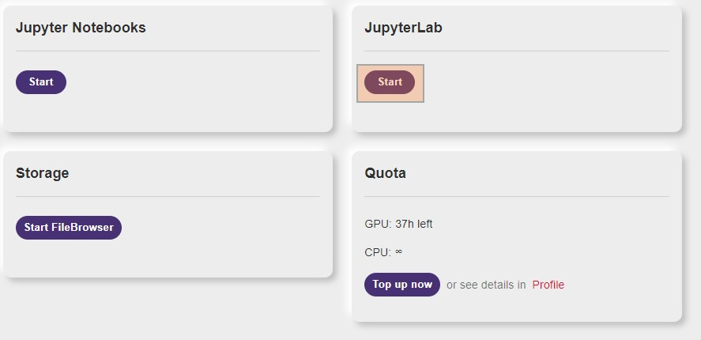
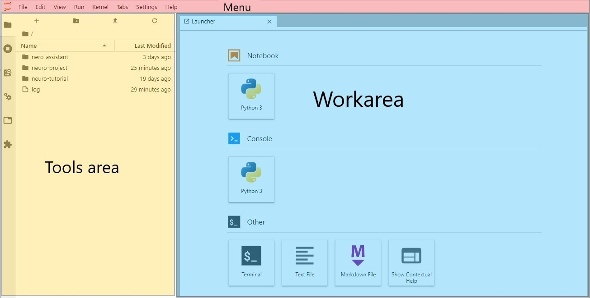
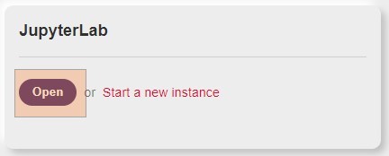

# JupyterLab

Jupyter Notebooks - это мощный вычислительный инструмент, который позволяет вам создавать и делиться своим кодом. JupyterLab использует Jupyter Notebook и делает немного больше. JupyterLab - это интерактивная веб-среда разработки для работы с Jupyter Notebooks, текстовыми редакторами, терминалами и пользовательскими компонентами.

Используя вкладки и разделители, Вы можете использовать несколько блокнотов, документов и других инструментов в одном интерфейсе. Кроме того, JupyterLab имеет модульную расширяемую архитектуру, которая позволяет настраивать среду разработки. Jupyter Notebook - это только один из компонентов, с которым Вы можете работать в JupyterLab.

Вы можете запустить новый экземпляр JupyterLab, нажав на кнопку Start в области JupyterLab.

Когда вы запускаете JupyterLab, дисковое пространство платформы подключается к /var/storage. Все данные, созданные во время сеанса сохраняются и могут быть использованы позже. Экземпляр не уничтожается при закрытии вкладки. Вы всегда можете открыть экземпляр с панели инструментов Neu.ro. Однако, экземпляр прекращает работу автоматически через 24 часа после инициализации.

Все экземпляры JupyterLab - это задания, которые выполняются с пресет GPU-small. Необходимо закрыть сеанс JupyterLab, когда работа будет закончена, иначе будут потребляться часы GPU. Все сессии JupyterLab автоматически уничтожаются через 24 часа.

Пользовательский интерфейс Jupyter имеет следующие области:

* Tools area: Здесь перечислены наиболее часто используемые команды.
* Work area: Рабочая область содержит ярлыки для запуска и вкладки, над которыми Вы сейчас работаете.
* Menu: Панель с меню включает в себя все доступные опции JupyterLabs.

В области инструментов перечислено множество параметров, доступных в JupyterLabs, таких как:

* File Browser для управления файлами.
* Sessions для управления списком активных сессий.
* Commands для просмотра команд, доступных в текущем состоянии.
* Properties для управления свойствами для текущего выбора.
* Tabs для просмотра списка открытых вкладок.
* Extension Manager для включения и управления расширениями.

Для получения дополнительной информации о JuputerLab, см. документацию [JupyterLab](https://jupyterlab.readthedocs.io/en/stable/).

## Управление экземплярами JupyterLab

Вы можете управлять своими экземплярами JupyterLab с панели инструментов Neu.ro. Экземпляры JupyterLab перечислены в разделе Running Jobs, а их URL-адреса начинаются с [http://jupyter-lab-](http://jupyter-lab-). Чтобы открыть экземпляр, надо нажать на URL.

Чтобы посмотреть подробную информацию об экземпляре JupyterLab, необходимо нажать на ID задания.

Чтобы открыть экземпляр:

* Надо нажать на кнопку Open в разделе Jupyter Notebooks.

* Нажать на URL экземпляра.

Экземпляр указан как задание в информационной панели Neu.ro. Можно закончить работу экземпляра из раздела Running Jobs на панели инструментов. Обратите внимание, что закрытие вкладки не прекращает работу экземпляра.

Кроме того, можно прекратить работу экземпляра из JupyterLab, используя опцию File &gt; Shut Down.

Экземпляр автоматически завершает работу через 24 часа после инициализации.

