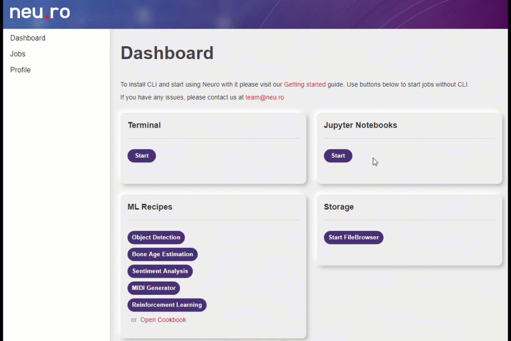

# ML Recipes

Neu.ro provides you with curated demonstrations of different machine learning solutions. You can use these ML solutions as a starting point for your own projects.

Neu.ro provides the following demo ML recipes:

- [**Object Detection**](https://docs.neu.ro/cookbook/object-detection) **:** This recipe supports a complete object detection pipeline for objects in the Common Objects in Context (COCO) dataset. This lets you evaluate performance on real-life images, and to build new classes.
- [**Bone Age Estimation**](https://docs.neu.ro/cookbook/pediatric-bone-age-assessment) **:** This recipe demonstrates how to determine the age of a child using an x-ray image of the left hand.
- [**Sentiment Analysis**](https://docs.neu.ro/cookbook/hierarchical-attention-for-sentiment-classification) **:** This recipe demonstrates how to apply a two-step architecture to classify sentiment.
- [**MIDI Generator**](https://docs.neu.ro/cookbook/midi-generator) **:** This recipe demonstrates how to generate new MIDI files or edit existing MIDI files.
- [**Reinforcement Learning**](https://docs.neu.ro/cookbook/deep-q-learning-dqn) **:** This recipe demonstrates a simplistic approach to reinforcement learning.

For more information about the ML recipes, see the [cookbook](https://docs.neu.ro/cookbook/cookbook) or click on the links above.

All curated recipes are run on the gpu-small preset. The recipes are not connected to the storage, so changes to the recipes will be lost when you close the recipe. You can download the files to save your changes to the local storage. You must kill the ML recipe session whenever you are done; else, it consumes GPU hours. All sessions are automatically killed after 24 hours of inactivity.

You can start a recipe either from the CLI or the web interface. To start a recipe from the CLI, you must install CLI, login into the CLI, and clone the recipe. For example, to start the [**Object Detection**](https://docs.neu.ro/cookbook/object-detection) recipe run the following commands

```
git clone git@github.com:neuromation/ml-recipe-object-detection.git
cd ml-recipe-object-detection
make setup
make jupyter
```

Alternatively, you can start the recipe from the Web interface. To start a recipe from the web interface, click on the recipe.



While running a recipe, you can click on the Jupyter icon to view the main screen and review all the files for the solutions.