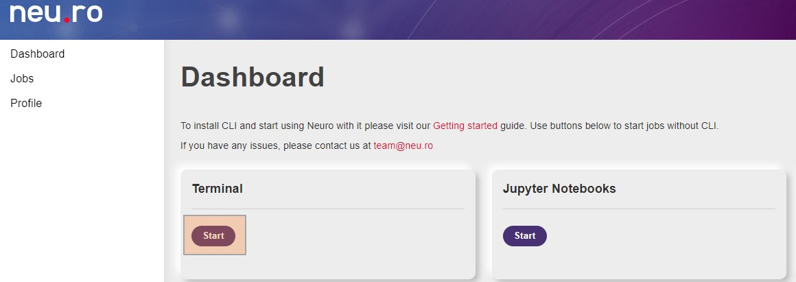

# Терминал

## Введение

Терминалы позволяют работать с Neu.ro без настройки локального окружения. Терминалы - это задания, активные терминалы перечислены на панели управления Neu.ro.



Вы можете запустить новый терминал, нажав кнопку Start в области Terminal. Терминал можно использовать для управления заданиями и средой докера. Необходимо закрыть сеанс терминала, когда Вы закончите работать. Все терминальные сеансы автоматически закрываются через 24 часа.

Когда вы запускаете терминал, дисковое пространство платформы подключается как /var/storage. Ваш терминальный сеанс начинается в этой папке. Все данные, созданные во время сеанса терминала сохраняются и могут быть использованы позже. Терминальные сеансы не обеспечивают контроль версий, исключая случаи, когда Вы используете базовую авторизацию \(через имя пользователя и пароль\) или свой токен доступа к диску.

## Загрузка данных через терминал

У Вас нет доступа к локальной файловой системе из сеанса терминала. Кроме того, Вы не можете загружать данные из терминала на локальный компьютер. Однако, Вы можете загрузить данные с любого внешнего ресурса, используя терминал. См. [Дисковое пространство](https://github.com/neuromation/platform-docs/tree/8c2237b1dbb6b440fcdeb85fbe5156280f490138/web/link%20to%20Storage%20docs/README.md) для подробной информации.

## Подключение к работающему заданию

Возможно подключиться к работающему заданию из терминала и выполнять команды, используя команду `neuro job exec`.

**Пример команды:**

1. **Выполнение простой команды list в контейнере, в котором размещено задание**

```text
root@job-a8cd05fe-57bd-4359-a388-e6ee1f92a269:/var/storage/neuro-tutorial/SampleCode/VoiceExperiment# neuro job exec job363 ls
The authenticity of host 'ssh-auth.neuro-public.org.neu.ro (34.194.131.79)' can`t be established.
ECDSA key fingerprint is SHA256:p0rIvIDzdWvwqNtslE2agZDai7NFYz5VdrKrZI+7O2Y.Are you sure you want to continue connecting (yes/no)?yes
bin dev home lib32 libx32 mnt proc run srv tmp varboot etc lib lib64 media opt root sbin sys usr
Connection to ssh-auth.neuro-public.org.neu.ro closed.
```

1. **Предоставление bash-терминала для контейнера, в котором размещено задание**

```text
root@job-a8cd05fe-57bd-4359-a388-e6ee1f92a269:/var/storage/neuro-tutorial/SampleCode/VoiceExperiment# neuro job exec job363 /bin/bashroot@job-36d59977-84d2-40e5-9475-e4af25a06b6c:/# echo 'Hello, World!'
Hello, World!
root@job-36d59977-84d2-40e5-9475-e4af25a06b6c:/# exit
exit
Connection to ssh-auth.neuro-public.org.neu.ro closed.
```

Терминал позволяет работать в контейнере во время выполнения задания.

## Создание нового проекта

Из веб-терминала можно создать новый проект. Для инициализации нового проекта необходимо использовать команду `init`. В качестве дискового пространства для проекта можно использовать пространство, доступное в /var/storage.

Например, Вы можете обучить свою первую модель машинного обучения на платформе Neu.ro из терминальной сессии. Когда Вы инициализируете проект, Вам предлагается ответить на несколько простых вопросов, чтобы настроить проект. Проект создается на основе этих ответов. Файлы проекта сохраняются на диске, если вы не измените рабочий каталог /var/storage.

В примере ниже показано создание проекта.


